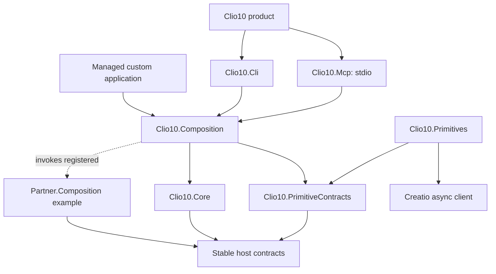

# Clio 10

A fresh .NET 10 blueprint for porting Clio 8 behavior into independently testable layers. Open **Clio10.slnx** at the repository root on branch `krylov/clio-10-experiment`. This branch intentionally replaces the legacy source tree with the experimental solution; it is not intended to merge into master as-is. The migration currently implements 21 operations: maintenance, service calls, compilation, catalogs, profile culture, local package versions, dependency editing, package activation, package archives including ZIP/directory batches, and compiled package file inspection. See the [migration ledger](docs/porting/README.md) for exact scope and remaining gaps. This is an experimental foundation, not feature parity or a published release.

An opt-in [complete runtime update proof](docs/runtime-update-proof.md) exercises Composition and primitive V1-to-V2 activation over the same MCP connection, including changed workflows and a newly added operation. Core and adapters remain running.

See the [development team guide](docs/agent-team.md) for project roles and invocation. The team pilot also adds [verify-file](docs/verify-file.md), a new local SHA-256 verification operation separate from the 21 legacy ports. Its [execution record](docs/agent-runs/verify-file.md) tracks layer assignments, functional proof and independent review.

## Layers

Start with the [architectural principles](docs/architectural-principles.md) for layer ownership, class placement and incremental Clio 8 porting rules.



| Project | Responsibility |
|---|---|
| src/Clio10 | Shipping tool; surface selection and shutdown. |
| src/Cli | CLI parsing and JSON presentation. References Composition only among Clio projects. |
| src/Mcp | Optional stdio MCP adapter. References Composition only. |
| src/Composition | Registered workflows, sequencing, validation and default wiring. |
| src/Core | Environment snapshots, local coordination, bundle selection and session lifetime. No concrete primitive reference. |
| src/Runtime | Complete release entry point: wires Composition and primitives using borrowed Core services. |
| src/Primitives | HTTP via Creatio.Client.IAsyncCreatioClient and filesystem I/O; session-owned authentication. |
| src/Contracts | Stable host interfaces/data; no feature capability or transport SDK dependencies. |
| src/PrimitiveContracts | Typed feature capabilities and DTOs shared inside a complete runtime by Composition and Primitives. |
| examples/Partner.Composition | Separate optional workflows; references host/primitive contracts and DI. |
| tests/* | Separate workflow, Core, transport and product tests. |

The application awaits IClioComposition.ExecuteAsync. Composition selects a workflow; Core opens one environment-bound session; nested workflows borrow it. Results return through ordinary C# calls. Progress is separate; no log parsing or subprocess protocol connects layers.

## Build and run

```shell
dotnet build Clio10.slnx -c Release
dotnet test Clio10.slnx -c Release --no-build
dotnet run --project src/Clio10 -- --help
```

Set CLIO10_PASSWORD in the process environment before explicit live execution:

```shell
clio --execute restart https://your-creatio/ username netcore
clio --execute flush-redis https://your-creatio/ username netcore
clio mcp https://your-creatio/ username netcore
```

Use framework for .NET Framework routes. No-argument startup does no remote work. Legacy settings are never implicitly imported. Certificate validation is enabled; CLIO10_ALLOW_UNTRUSTED_CERTIFICATE=true explicitly opts into a self-signed lab.

CLI/MCP are reusable adapter libraries bundled by the product. A managed app can reference Composition without CLI/MCP dependencies. HTTP MCP hosting and NativeAOT embedding are not implemented.

## Embed and extend

```csharp
var services = new ServiceCollection();
services.AddClioComposition(new CompositionOptions(
    new Uri("https://your-creatio/"), userName, password));
services.AddPartnerWorkflows(); // optional partner assembly
await using var provider = services.BuildServiceProvider();
await using var scope = provider.CreateAsyncScope();
var composition = scope.ServiceProvider.GetRequiredService<IClioComposition>();
var result = await composition.ExecuteAsync(new CompositionRequest(
    "partner.flush-then-restart", Arguments: new Dictionary<string, object?> {
        ["restart-after-flush"] = true
    }), cancellationToken: cancellationToken);
```

Composition setup supplies defaults. Register IPrimitiveCatalog or IEnvironmentResolver before defaults to override them. Bundle registrations are additive; set IncludeDefaultPrimitives=false when supplying a replacement bundle with the same version. Hosts can also pass CoreOptions with named environments. Core has no test-only shortcut. Partners implement IClioWorkflow, register a keyed scoped handler and separate WorkflowRegistration metadata with DI; the example is not bundled into the tool.

Arguments support strings, booleans, integers, finite numbers, nested dictionaries and arrays. Composition snapshots them and checks descriptor schemas before opening Core. Child calls receive explicit replacement arguments; omitted arguments mean an empty object. Await children sequentially and finish them before returning. Core rejects nested roots; Composition rejects overlapping children and drains any unfinished child before releasing ownership. OperationResult.Payload can carry a typed data record; adapters serialize it, while managed callers can consume the type directly. AcceptedSteps records partial acceptance.

The partner example also reads real files through IFileSystemPrimitive and composes two inspections with independent inputs. A local-only host uses `new CompositionOptions()` without a Creatio URL. Custom products call `AddClioCli(s => s.AddPartnerWorkflows())` or `AddClioMcp(s => s.AddPartnerWorkflows())`; the existing adapters discover and execute these operations automatically. The test-only PartnerHost proves both routes using `--execute partner.compare-texts --local <arguments-json>` and `mcp --local`.

Feature interfaces are runtime-owned: see [the contract boundary and live update proof](docs/primitive-contract-boundary.md). Core neither references nor shares these interfaces in complete-runtime mode. Static embedding can still use typed capabilities through explicitly shared contracts.

## Versions and settings

Set `CLIO10_RUNTIME_COMPOSITION=true` to select complete Composition+primitive releases from `CLIO10_BUNDLES`. See the [runtime proof](docs/runtime-update-proof.md) for acquisition, compatibility, per-root pinning and the local preview package. Without this opt-in, Composition stays static and only primitives are selected dynamically.

CLIO10_BUNDLES selects complete version directories with bundle.json manifests instead of bundled defaults. Optional CLIO10_PRIMITIVE_VERSION=10.0.0.0 pins a release. Otherwise Core chooses the newest compatible bundle. Checks cover contract version, range and capabilities, not identical behavior. The capability-provider boundary is ABI 2; old ABI 1 bundles are rejected. One complete bundle remains pinned for the whole workflow.

Managed hosts can set CompositionOptions.SettingsPath to a JSON dictionary of named environments. Core reads a snapshot per root invocation; CompositionRequest.EnvironmentName selects it. Existing contexts retain their snapshots. Editing/migration and cross-process synchronization are not implemented. Protect credentials through filesystem permissions. CLI supports explicit named settings with `-e <name> --settings <file>` (or CLIO10_SETTINGS). MCP currently configures one explicit target.

## Package locally

```shell
dotnet pack Clio10.slnx -c Release -o artifacts/packages -p:Version=10.0.0-preview.20
dotnet tool install clio --version 10.0.0-preview.20 --tool-path artifacts/tool-preview20 --configfile scripts/local-packages.config --add-source artifacts/packages
```

Run artifacts/tool-preview20/clio.exe --help on Windows, or the extensionless command elsewhere. This leaves the global tool unchanged. Libraries pack separately; the tool bundles dependencies. Dynamic loading needs a complete dependency output and manifest, not just an extracted library NuGet. The opt-in MCP background service downloads complete bundle packages; see the update proof for supported sources and limits.

Production dependencies: Microsoft DI/Hosting, MCP SDK in its adapter, creatio.client in Primitives. Creatio SDK brings Newtonsoft privately; SDK types do not cross contracts. Versions are centralized. NUnit, FluentAssertions and NSubstitute are test-only.

## Evidence and limits

The dedicated Clio10Architecture lab runs Creatio 10.1.585/PostgreSQL. The new product called restart and Redis flush; both returned success:true. Authenticated connection worked afterward. Both local bundle versions executed against the lab. See [current verification and review](docs/design-convergence.md) and [earlier live evidence](docs/validation.md).

HTTP acceptance is not readiness or exactly-once execution. The SDK may renew authentication and replay an unauthorized request despite transport retries being disabled. A lost connection after dispatch is outcome-unknown. Endpoint-specific interpretation belongs in workflows.

CI redesign is deferred. Local tests do not establish all-platform/live-.NET-Framework parity. Bundle loading is trusted in-process code, not a sandbox. Host replacement, automatic unloading, plugin-folder discovery and cross-process locking remain outside this slice.

See [architecture](docs/architecture.md), [contributing](CONTRIBUTING.md), and [commands](docs/commands.md).

The revised [agent-team trial](docs/agent-runs/compare-directories.md) adds [compare-directories](docs/compare-directories.md), a read-only local tree comparison using SHA-256 and the existing generic CLI/MCP adapters.
