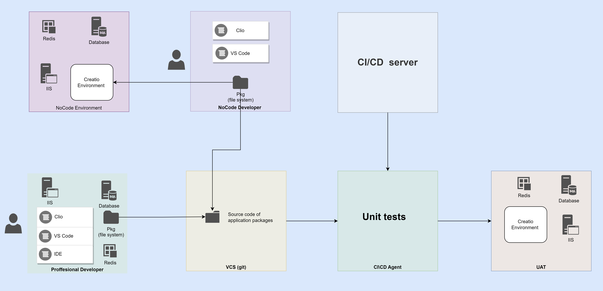
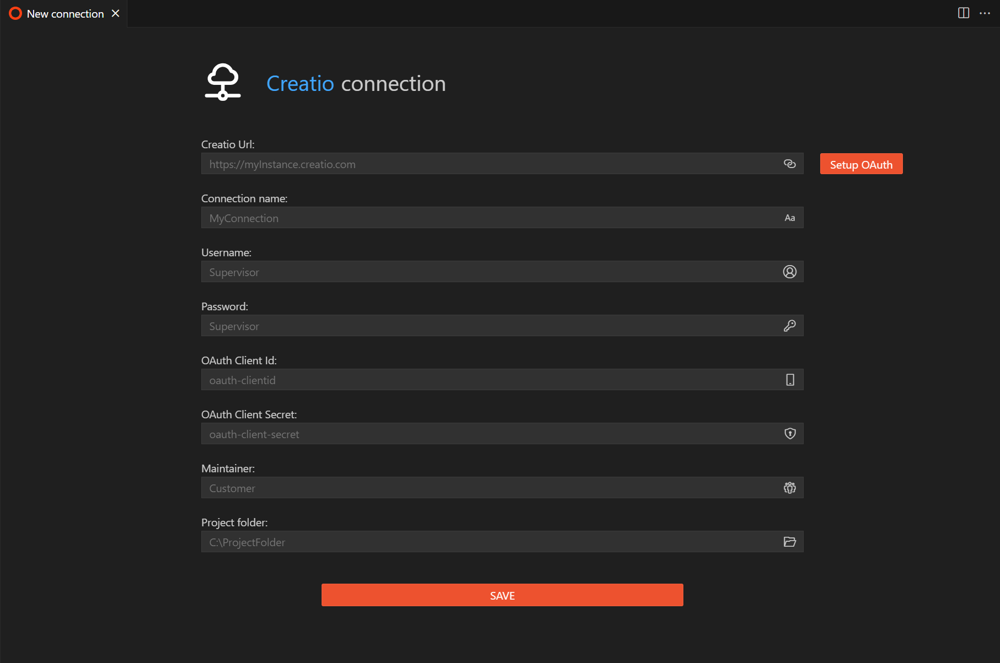
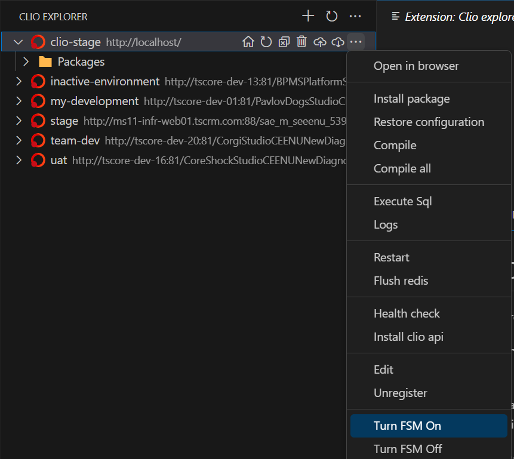
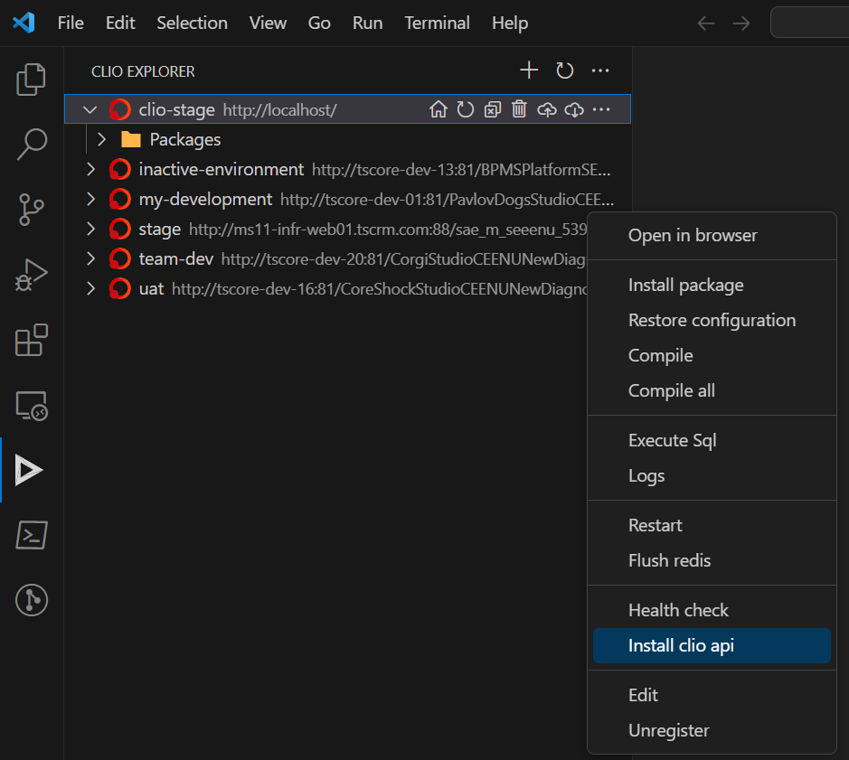
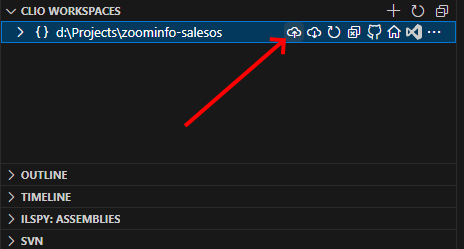
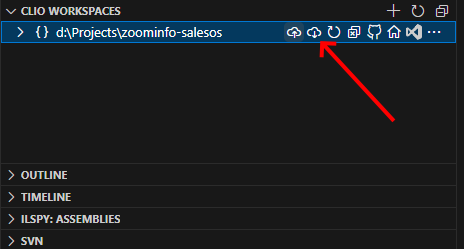

# Organize common development flow for No-Code and Professional developers


## Initialize environment




## Professional developers

1. Install clio
    ```bash
    dotnet tool install clio -g
    ```
    > Recommended plugin [clio explorer](https://marketplace.visualstudio.com/items?itemName=AdvanceTechnologiesFoundation.clio-explorer) for [VS Code](https://code.visualstudio.com/download)
2. Deploy Creatio instance locally. [Creatio Academy](https://academy.creatio.com/docs/7-18/user/on_site_deployment/general_deployment_procedure/general_creatio_deployment_procedure) or using [clio automation](https://github.com/Advance-Technologies-Foundation/clio#installation-of-creatio-using-clio)
3. [Register environment in clio](https://github.com/Advance-Technologies-Foundation/clio#environment-settings) or via clio explorer. If you deployed Creatio locally, with clio, you can skip this step
   
   
4. Turn on [FSM mode](https://academy.creatio.com/docs/developer/development_tools/external_ides/overview#title-2098-3) via clio explorer
   
   
5. Create a [workspace](https://github.com/Advance-Technologies-Foundation/clio#workspaces) for the project
   ```bash
    clio create-workspace
    ```
6. Create application in Creatio and link packages to workspace
   ```bash
    clio l2r -r "<PATH_TO_WORKSPACE_FOLDER>" \
    -e "<LOCAL_CREATIO_PATH>\Terrasoft.WebApp\Terrasoft.Configuration\Pkg" \
    -p "<AppPackage1>,<AppPackage2>,<...>"
    ``` 
7. Link workspace with environment, add settings in file `<workspace_path>/.clio/workspaceEnvironmentSettings.json` your environment
    ```json
    {
      "Environment": "<env_name>"
    }
    ```
    add settings of your environment in `<workspace_path>/.clio/workspaceSettings.json`
    ```json
    {
      "Packages": ["AppPackage1","AppPackage2"],
      "ApplicationVersion": "8.1.0"
    }
    ```
8. Download configuration to workspace
    ```bash
    clio dconf -e <env_name>
    ```
    > Configuration files are required to organize CI\CD pipelines and unit tests
9. Create Git repository for workspace folder

## No-Code developer

1. Gets access to Creatio instance and register it with clio explorer

   

2. Install `clio api` on the Creatio instance, use command line in clio or clio explorer
   ```bash
   clio install-gate -e <env_nname>
   ```
   

3. Download previously initialized workspace from git repository
   
   ```bash
   git clone <git_repo_url>
   ```

4. Install application on creatio instance with clio explorer

    

5. To get changes from the environment, use a pull workspace option

   
    
6. Commit workspace changes to git repository with VS Code or other git client


## Unit testing

1. Create directory for unit tests
2. Create solution for unit tests
3. Add reference to Creatio packages
4. Add reference to Creatio configuration files
5. Add reference to Creatio core libraries
6. Add reference to Creatio test core libraries

> For correct references to core and configuration libraries, use environment variables in Test csproj file.

<details>
<summary>Sample csproj for unit test project</summary>

```xml
<Project Sdk="Microsoft.NET.Sdk">
    <PropertyGroup>
        <TargetFramework>net472</TargetFramework>
        <IsPackable>false</IsPackable>
        <TestCoreLibPath Condition="'$(TestCoreLibPath)' == ''">../../.application/net-framework/core-bin</TestCoreLibPath>
        <RootNamespace>MrktZoomInfoInC360.Tests</RootNamespace>
        <PlatformTarget>x64</PlatformTarget>
        <!-- Exclude the project from analysis -->
        <SonarQubeExclude>true</SonarQubeExclude>
    </PropertyGroup>
       
    <ItemGroup>
        <Reference Include="System.Web" />
        <Reference Include="Terrasoft.Configuration">
            <HintPath>$(TestCoreLibPath)\..\bin\Terrasoft.Configuration.dll</HintPath>
        </Reference>
    </ItemGroup>
    
    <ItemGroup Label="Nuget packages">
        <PackageReference Include="coverlet.msbuild" Version="3.2.0">
            <PrivateAssets>all</PrivateAssets>
            <IncludeAssets>runtime; build; native; contentfiles; analyzers; buildtransitive</IncludeAssets>
        </PackageReference>
        <PackageReference Include="FluentAssertions" Version="5.6.0" />
        <PackageReference Include="Microsoft.Extensions.DependencyInjection.Abstractions" Version="3.1.6" />
        <PackageReference Include="Microsoft.Extensions.Logging.Abstractions" Version="3.1.6" />
        <PackageReference Include="NUnit" Version="3.13.3" />
        <PackageReference Include="NUnit3TestAdapter" Version="4.5.0" />
        <PackageReference Include="Microsoft.NET.Test.Sdk" Version="17.7.2" />
        <PackageReference Include="Castle.Core" version="4.4.0" />
        <PackageReference Include="Ninject" version="3.3.3" />
        <PackageReference Include="NSubstitute" version="3.1.0" />
        <PackageReference Include="System.Runtime" version="4.3.0" />
        <PackageReference Include="System.Threading.Tasks.Extensions" version="4.5.4" />
        <Reference Include="*">
          <HintPath>.\Libs\Terrasoft.TestFramework.dll</HintPath>
        </Reference>
        <Reference Include="UnitTest">
            <HintPath>.\Libs\UnitTest.dll</HintPath>
        </Reference>
    </ItemGroup>
    <ItemGroup Label="Core References">
        <Reference Include="Terrasoft.Common">
            <HintPath>$(TestCoreLibPath)/Terrasoft.Common.dll</HintPath>
            <SpecificVersion>False</SpecificVersion>
            <Private>True</Private>
        </Reference>
        <Reference Include="Terrasoft.Core">
            <HintPath>$(TestCoreLibPath)/Terrasoft.Core.dll</HintPath>
            <SpecificVersion>False</SpecificVersion>
            <Private>True</Private>
        </Reference>
        <Reference Include="Terrasoft.Web.Common">
            <HintPath>$(TestCoreLibPath)/Terrasoft.Web.Common.dll</HintPath>
            <SpecificVersion>False</SpecificVersion>
            <Private>True</Private>
        </Reference>
        <Reference Include="Terrasoft.GlobalSearch">
            <HintPath>$(TestCoreLibPath)/Terrasoft.GlobalSearch.dll</HintPath>
            <Private>True</Private>
        </Reference>
        <Reference Include="Terrasoft.Nui.ServiceModel">
            <HintPath>$(TestCoreLibPath)/Terrasoft.Nui.ServiceModel.dll</HintPath>
            <Private>True</Private>
        </Reference>
        <Reference Include="Terrasoft.Web.Http.Abstractions">
            <HintPath>$(TestCoreLibPath)/Terrasoft.Web.Http.Abstractions.dll</HintPath>
            <SpecificVersion>False</SpecificVersion>
            <Private>True</Private>
        </Reference>
        <Reference Include="Terrasoft.Core.ConfigurationBuild">
            <HintPath>$(TestCoreLibPath)/Terrasoft.Core.ConfigurationBuild.dll</HintPath>
            <SpecificVersion>False</SpecificVersion>
            <Private>True</Private>
        </Reference>
        <Reference Include="Terrasoft.Core.DI">
            <HintPath>$(TestCoreLibPath)/Terrasoft.Core.DI.dll</HintPath>
            <SpecificVersion>False</SpecificVersion>
            <Private>True</Private>
        </Reference>
        <Reference Include="Terrasoft.Core.Packages">
            <HintPath>$(TestCoreLibPath)/Terrasoft.Core.Packages.dll</HintPath>
            <SpecificVersion>False</SpecificVersion>
            <Private>True</Private>
        </Reference>
        <Reference Include="Terrasoft.Core.Process">
            <HintPath>$(TestCoreLibPath)/Terrasoft.Core.Process.dll</HintPath>
            <SpecificVersion>False</SpecificVersion>
            <Private>True</Private>
        </Reference>
        <Reference Include="Terrasoft.Core.Scheduler">
            <HintPath>$(TestCoreLibPath)/Terrasoft.Core.Scheduler.dll</HintPath>
            <SpecificVersion>False</SpecificVersion>
            <Private>True</Private>
        </Reference>
        <Reference Include="Terrasoft.Core.ScriptEngine">
            <HintPath>$(TestCoreLibPath)/Terrasoft.Core.ScriptEngine.dll</HintPath>
            <SpecificVersion>False</SpecificVersion>
            <Private>True</Private>
        </Reference>
        <Reference Include="Terrasoft.Core.Translation">
            <HintPath>$(TestCoreLibPath)/Terrasoft.Core.Translation.dll</HintPath>
            <SpecificVersion>False</SpecificVersion>
            <Private>True</Private>
        </Reference>
        <Reference Include="Terrasoft.File.Abstractions">
            <HintPath>$(TestCoreLibPath)/Terrasoft.File.Abstractions.dll</HintPath>
            <SpecificVersion>False</SpecificVersion>
            <Private>True</Private>
        </Reference>
        <Reference Include="Terrasoft.File">
            <HintPath>$(TestCoreLibPath)/Terrasoft.File.dll</HintPath>
            <SpecificVersion>False</SpecificVersion>
            <Private>True</Private>
        </Reference>
        <Reference Include="Terrasoft.GoogleServerConnector">
            <HintPath>$(TestCoreLibPath)/Terrasoft.GoogleServerConnector.dll</HintPath>
            <SpecificVersion>False</SpecificVersion>
            <Private>True</Private>
        </Reference>
        <Reference Include="Terrasoft.IO">
            <HintPath>$(TestCoreLibPath)/Terrasoft.IO.dll</HintPath>
            <SpecificVersion>False</SpecificVersion>
            <Private>True</Private>
        </Reference>
        <Reference Include="Terrasoft.Monitoring">
            <HintPath>$(TestCoreLibPath)/Terrasoft.Monitoring.dll</HintPath>
            <SpecificVersion>False</SpecificVersion>
            <Private>True</Private>
        </Reference>
        <Reference Include="Terrasoft.Nui">
            <HintPath>$(TestCoreLibPath)/Terrasoft.Nui.dll</HintPath>
            <SpecificVersion>False</SpecificVersion>
            <Private>True</Private>
        </Reference>
        <Reference Include="Terrasoft.Messaging.Common">
            <HintPath>$(TestCoreLibPath)/Terrasoft.Messaging.Common.dll</HintPath>
            <SpecificVersion>False</SpecificVersion>
            <Private>True</Private>
        </Reference>
        <Reference Include="Terrasoft.Mobile">
            <HintPath>$(TestCoreLibPath)/Terrasoft.Mobile.dll</HintPath>
            <SpecificVersion>False</SpecificVersion>
            <Private>True</Private>
        </Reference>
        <Reference Include="Terrasoft.Services">
            <HintPath>$(TestCoreLibPath)/Terrasoft.Services.dll</HintPath>
            <SpecificVersion>False</SpecificVersion>
            <Private>True</Private>
        </Reference>
        <Reference Include="Terrasoft.Social">
            <HintPath>$(TestCoreLibPath)/Terrasoft.Social.dll</HintPath>
            <SpecificVersion>False</SpecificVersion>
            <Private>True</Private>
        </Reference>
        <Reference Include="Terrasoft.Sync">
            <HintPath>$(TestCoreLibPath)/Terrasoft.Sync.dll</HintPath>
            <SpecificVersion>False</SpecificVersion>
            <Private>True</Private>
        </Reference>
        <Reference Include="Terrasoft.GlobalSearch">
            <HintPath>$(TestCoreLibPath)/Terrasoft.GlobalSearch.dll</HintPath>
            <SpecificVersion>False</SpecificVersion>
            <Private>True</Private>
        </Reference>
        <Reference Include="Creatio.FeatureToggling">
            <HintPath>$(TestCoreLibPath)/Creatio.FeatureToggling.dll</HintPath>
            <SpecificVersion>False</SpecificVersion>
            <Private>True</Private>
        </Reference>
        <Reference Include="Common.Logging">
            <HintPath>$(TestCoreLibPath)/Common.Logging.dll</HintPath>
            <SpecificVersion>False</SpecificVersion>
            <Private>True</Private>
        </Reference>
        <Reference Include="Common.Logging.Core">
            <HintPath>$(TestCoreLibPath)/Common.Logging.Core.dll</HintPath>
            <SpecificVersion>False</SpecificVersion>
            <Private>True</Private>
        </Reference>
    </ItemGroup>
    <ItemGroup>
      <ProjectReference Include="..\..\packages\AppPackage\Files\AppPackage.csproj" />
    </ItemGroup>
</Project>
```

</details>


## CI\CD process
Sample GitLab CI\CD configuration file `.gitlab-ci.yml` for Creatio application

<details>
<summary>Sample GitLab CI\CD configuration file</summary>

```yaml
stages:
  - pre deploy
  - deploy

variables:
  GIT_DEPTH: 0
  GIT_SUBMODULE_STRATEGY: none

#steps
deploy:
  stage: deploy
  tags:
    - windows
  dependencies: []
  only:
    - master
  cache:
  script:
    - clio pushw -l $STAGING_LOGIN -p $STAGING_PWD -u $STAGING_URL
    - clio restart -l $STAGING_LOGIN -p $STAGING_PWD -u $STAGING_URL
  resource_group: clio

sonar-analysis:
  stage: pre deploy
  tags:
    - windows
  dependencies: []
  only:
    - master
    - merge_requests
  cache:
  script:
    - $env:CoreLibPath = '..\..\..\.application\net-framework\core-bin'
    - $env:TestCoreLibPath = '..\..\.application\net-framework\core-bin'
    - $env:RelativePkgFolderPath = '..\..\..\.application\net-framework\packages'
    - $env:CoreTargetFramework = 'net472'
    - dotnet sonarscanner begin `
        /k:$CI_PROJECT_NAME `
        /d:sonar.host.url=$SONAR_HOST_URL `
        /d:sonar.login=$SONAR_TOKEN `
        /d:sonar.cs.opencover.reportsPaths=".\tests\Results\coverage.opencover.xml" `
        /d:sonar.test.exclusions="tests/MyPackage.Tests/*" `
        /d:sonar.exclusions="**/Autogenerated/*" `
        /d:sonar.sourceEncoding=UTF-8 `
        /d:sonar.qualitygate.wait=true `
        /d:sonar.qualitygate.timeout=1000
    - dotnet test .\tests\MyPackage.Tests.sln /p:CollectCoverage=true /p:CoverletOutputFormat=opencover /p:CoverletOutput=..\Results\coverage.opencover.xml
    - dotnet sonarscanner end /d:sonar.login=$SONAR_TOKEN
```

</details>
