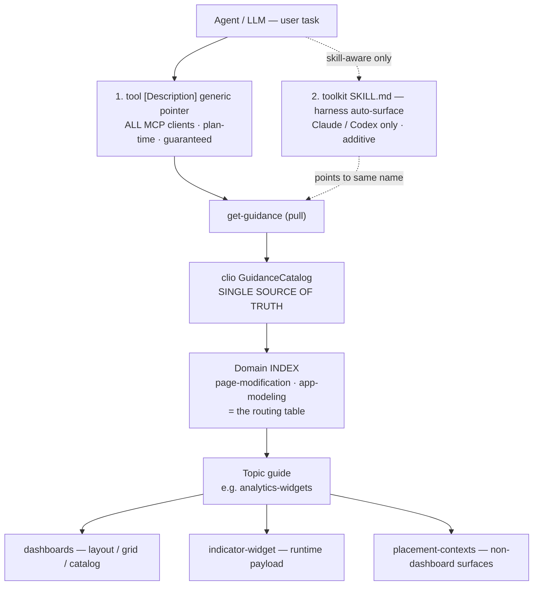
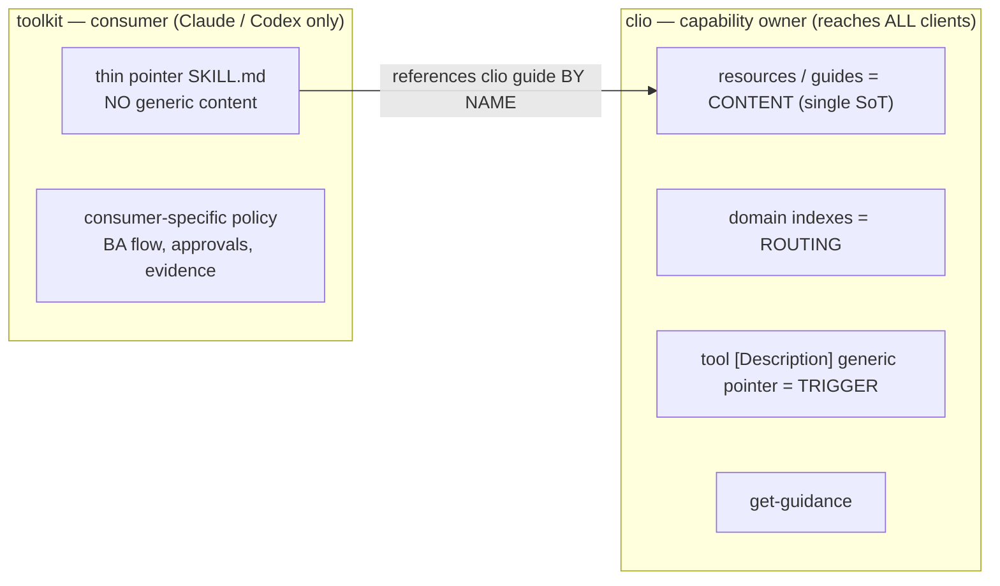
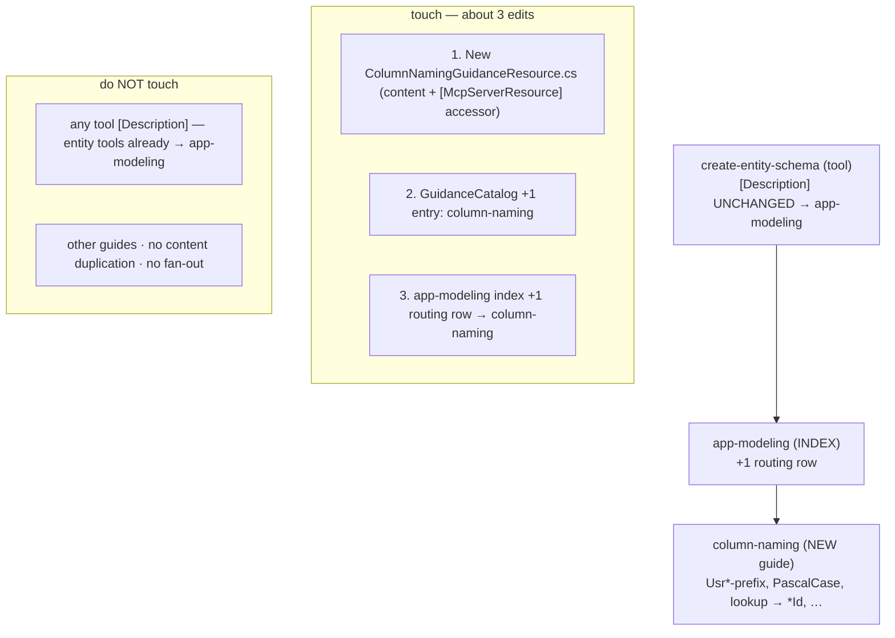

# clio MCP Guidelines — Architecture & Contribution Guide

How AI-facing guidance ("guidelines") is delivered through clio MCP, what belongs in clio
versus the ADAC toolkit and why, and the exact process for adding a new guideline without
re-introducing fan-out.

> Companion to the Confluence article *"MCP for coding agents: how to design tools, resources,
> prompts, and skills"* (Creatio TER space) and to `spec/adr/adr-analytics-widgets-floor.md`.

---

## 1. TL;DR

- **clio is the single source of truth** for generic guidance content. A guideline is a
  `*GuidanceResource.cs` registered in `GuidanceCatalog`, exposed as a `docs://mcp/guides/<name>`
  resource and pulled via the `get-guidance` tool. This **reaches every MCP client** (Claude,
  Copilot, Codex, Cursor, generic, direct-clio).
- **Routing is tiered, not fanned out.** A tool's `[Description]` names **only one generic index**
  (`page-modification` for page work, `app-modeling` for schema/entity work). The index routes to a
  topic guide; the topic guide routes to the precise sub-guides. The specific guide name lives in
  **exactly one place** — the index — never duplicated across tool descriptions.
- **The toolkit ships only thin pointer skills.** A skill is a harness-side construct (Claude /
  Codex only) and is invisible over the MCP wire. So the toolkit skill carries **no generic
  content** — it references clio guides by name. It is an *additive fast-path*, never the home of
  the content.
- **Adding a guideline = ~3 edits** (new resource + catalog entry + one index routing row),
  **zero tool-description edits**. The cost of the N-th guideline does not grow.

---

## 2. How guidelines work (runtime model)

MCP gives a server three surfaces — `tools` (do), `resources` (know), `prompts` (user entry).
`skills` (how the agent should behave) are a **harness-side** construct and are **not** an MCP
server surface (a "skills primitive" is only *investigating* on the MCP roadmap). clio therefore
delivers behavior/knowledge as **resources** and forces discovery through **tool descriptions** —
the only channels guaranteed to reach every client at planning time.



**Why a generic pointer instead of naming the specific guide on the tool?** Both are just text the
agent must read to call the tool; naming the specific guide inline buys at most one fewer hop but
costs an ever-growing list of clauses on every tool (`update-page` once carried ~9). The index
gives the agent the **full routing map in one read** and keeps the trigger a single stable sentence
that never changes when guidelines are added.

---

## 3. What stays in clio MCP — and why

| Artifact | Lives in clio | Why |
|---|---|---|
| **Generic guidance content** (`*GuidanceResource.cs`) | yes — the floor | Only a clio-resident resource is reachable by **every** MCP client via `get-guidance`. |
| **Domain indexes** (`page-modification`, `app-modeling`) | yes | Routing is single-sourced here; the place a new guideline name is added. |
| **Topic + precise guides** (`analytics-widgets`, `dashboards`, `indicator-widget`, …) | yes | Behavior couples to capability; co-locating with the tools minimizes drift. |
| **The trigger** (one generic pointer in each tool `[Description]`) | yes | The only guaranteed, plan-time, all-client forcing channel. |
| **`get-guidance` discovery hint** | yes | Self-advertises available guide names. |
| **Hard invariants** (truncatable router in `McpServerInstructions`) | yes | Names-only; must survive client truncation. |

**Ownership rule:** generic clio-MCP behavior and its content belong to clio (the capability
owner). A consumer repo must never become the de-facto home of generic behavior — that duplicates
knowledge, strands other consumers, and forces cross-repo sync on every change.

---

## 4. What goes to the toolkit — and why it matters

The ADAC toolkit (`Creatio-Platform/creatio-ai-app-development-toolkit`, a different org) has the
one thing clio lacks: a **skill distribution channel** (a Claude/Codex plugin marketplace). The
harness **auto-surfaces a skill's name + description at planning time** and loads its body on
demand — a strong, truncation-immune discovery path **for the toolkit-installed Claude/Codex
segment**.



**Why it matters / why thin only:**

- A skill is **invisible over the MCP wire**. If generic content lived only in a toolkit skill,
  every non-toolkit client (Copilot, generic MCP, direct-clio, toolkit-less Cursor) would get
  **nothing** — a coverage hole, not a convenience gap.
- The toolkit lives in a **different repo/org with a different release cadence**. Any generic
  content there silently drifts from the clio tool behavior it describes.
- Therefore the toolkit skill is a **thin pointer**: it keeps the rich trigger `description`
  (so the harness surfaces it) but the body only routes to `get-guidance name=<guide>`. The
  authoritative content stays in clio; the skill degrades gracefully to the clio resource floor
  on clients that don't load it.
- A CI **drift tripwire** (`tests/test_release_structure.py`) asserts every clio guide name the
  SKILL.md references exists in a checked-in allowlist, so a rename/removal in clio fails the
  toolkit build.

**Reach vs delivery — the corrected ownership rule:** the *content's source of truth* is always
clio (a resource, reaching all clients). The *skill* is only a delivery vehicle for skill-aware
clients and may ship from the toolkit **as long as it references clio by name and adds no generic
content**. "skill in clio vs skill in toolkit" is a false dichotomy — the real axis is
**resource (the all-client floor) vs skill (the Claude/Codex fast-path)**.

---

## 5. The split rule (decision table)

| Use… | When the content is… | Reach | Home |
|---|---|---|---|
| **resource** (`get-guidance` guide) | knowledge / read-before-mutate | all clients (pull) | **clio** |
| **tool `[Description]` generic pointer** | one inevitable plan-time nudge | all clients, guaranteed | **clio** |
| **domain index row** | routing a topic to its guide | all clients | **clio** |
| **tool-result note** | post-execution correction | all clients (after the call) | **clio** |
| **router (`McpServerInstructions`)** | hard invariants, names-only | all clients, truncatable | **clio** |
| **skill (thin pointer)** | behavior fast-path for skill-aware clients | Claude / Codex only | **toolkit** |
| **prompt** | user-initiated scenario launcher | prompt-aware clients | clio or toolkit |
| **consumer policy** | BA flow, approvals, evidence, report shape | the consumer only | **toolkit** |

> One-line rule: *knowledge → resource; routing → index; one plan-time nudge → tool generic
> pointer; behavior fast-path → thin toolkit skill. If a specific guide name appears in more than
> one tool description, that is a fan-out regression — collapse it into the index.*

---

## 6. Adding a new guideline — step by step

Worked example: **`column-naming`** (correct entity/column naming). Column naming is triggered by
entity/schema tools (`create-entity-schema`, `modify-entity-schema-column`, `create-lookup`), which
already point at the **`app-modeling`** index — so that is the index it routes through. (Page-level
guidelines route through `page-modification` instead.)



### Steps

1. **Create the content.** `clio/Command/McpServer/Resources/ColumnNamingGuidanceResource.cs`,
   modeled on an existing thin guide. Mark it `[McpServerResourceType]`, expose
   `internal static readonly TextResourceContents Guide` at `docs://mcp/guides/column-naming`, and
   add a `[McpServerResource(UriTemplate = …, Name = "column-naming-guidance")]` accessor. Put the
   actual rules + examples in the body (e.g. `Usr` prefix, PascalCase, no spaces, lookup column →
   `<Name>Id`). Keep it as deep or as thin-index as the topic needs; do not duplicate content that
   already lives in another guide — reference it by name.

2. **Register it.** In `GuidanceCatalog.cs` `CreateEntries()`:
   ```csharp
   ["column-naming"] = Create(
       "column-naming",
       "Canonical naming rules for Creatio entities and columns: prefixes, casing, lookup *Id columns.",
       ColumnNamingGuidanceResource.Guide),
   ```

3. **Route to it from the domain index** — `AppModelingGuidanceResource.cs` (the index the entity
   tools already point at): add one routing line/row, e.g. *"naming an entity or column →
   `get-guidance name=column-naming`"*. This is the **only** place the specific name appears,
   mirroring the `analytics-widgets` row in the `page-modification` checklist.

4. *(Optional)* **Discovery hint** — add `column-naming` to the example list in `GuidanceGetTool`'s
   two argument `[Description]` hints.

5. *(Optional, Claude/Codex fast-path)* **Thin toolkit skill** — only if you want harness
   auto-surfacing: a `skills/column-naming/SKILL.md` whose body just routes to
   `get-guidance name=column-naming`, plus a tripwire-allowlist update. **No generic content.**
   Ships in the toolkit PR, merges **after** the clio PR.

6. **Tests** (mandatory per the MCP maintenance policy):
   - unit: the resource returns the right `Uri`/`MimeType`/content (`McpGuidanceResourceTests`);
   - unit: `get-guidance name=column-naming` resolves (`GuidanceGetToolTests`);
   - unit guard: the `app-modeling` index text still routes to `column-naming`;
   - e2e: `clio.mcp.e2e` retrieval + advertise (not in CI, but must compile);
   - run `dotnet test --filter "Category=Unit&Module=McpServer"`.

### Do NOT
- Do **not** add `column-naming` to any tool `[Description]` — the entity tools already carry the
  generic `app-modeling` pointer. Naming it on the tools is the fan-out regression this whole
  design exists to prevent.
- Do **not** put the content (only) in the toolkit — that strands non-toolkit clients.
- Do **not** hand-copy the content into a second place — single source of truth.

**Result:** ~3 edits, 0 tool-description edits, reachable by every MCP client via `get-guidance`
immediately.

---

## 7. Review checklist (merge-blocking)

- [ ] The specific guide name appears in **one** place (the domain index), not in tool descriptions.
- [ ] Generic content lives in clio as a resource (reaches all clients); the toolkit skill (if any)
      is a thin pointer with **zero** generic content, referencing clio by name.
- [ ] clio floor + trigger land **before/with** any toolkit skill (the skill points to a real guide).
- [ ] Name + URI are stable (`docs://mcp/guides/<name>`); a rename is a breaking contract change.
- [ ] Unit + e2e coverage added; `Category=Unit&Module=McpServer` is green; no new `CLIO*` diagnostics.
- [ ] If cross-repo and interim, an interim banner + migration ticket exist; the toolkit tripwire
      allowlist includes the referenced clio names.

---

## 8. References

- Confluence — *MCP for coding agents: how to design tools, resources, prompts, and skills* (TER space).
- `spec/adr/adr-analytics-widgets-floor.md` — the ADR that established this model.
- `docs/McpCapabilityMap.md` — MCP surface overview.
- FastMCP *Skills as Resources* provider — external precedent that skills-as-resources solves
  portability but **not** forcing (the trigger is a separate responsibility).
- MCP 2026 roadmap — a "Skills primitive" is *investigating*; until it ships, skills remain
  harness-side and clio delivers via resources + tool-description triggers.
