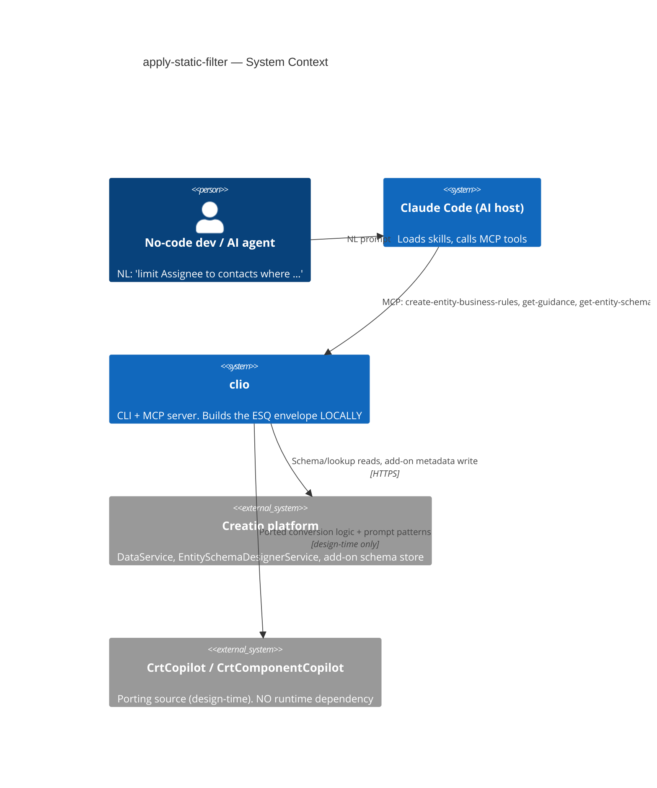
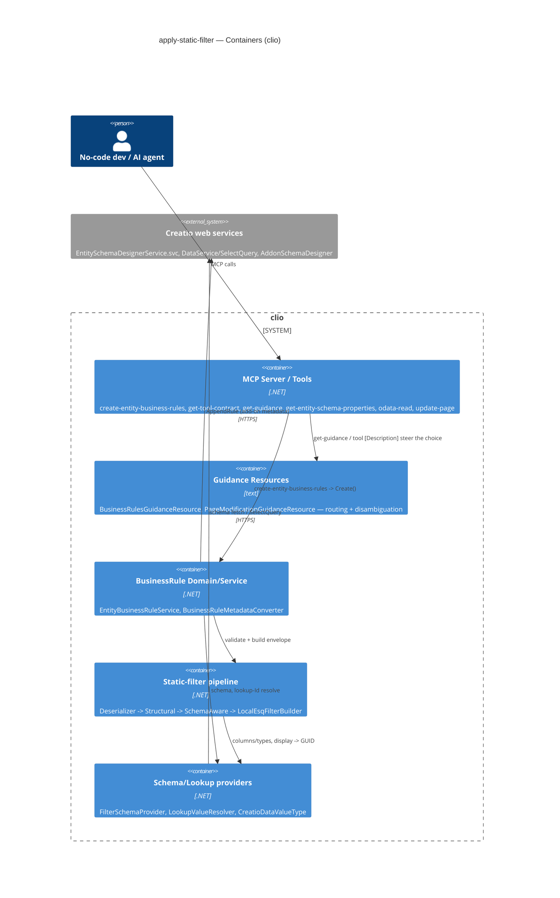
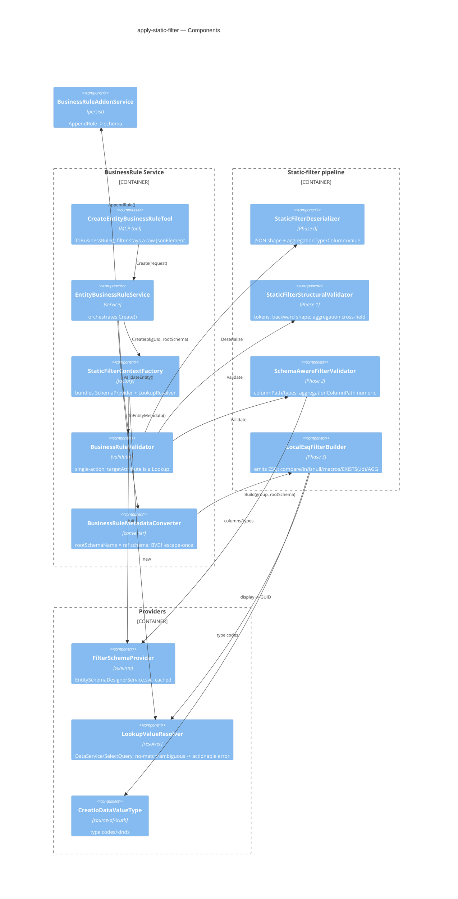
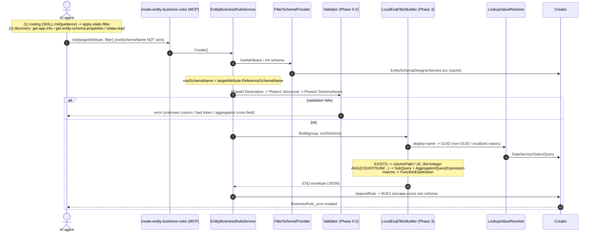

# apply-static-filter — architecture

`apply-static-filter` is an **entity-level Freedom UI business-rule action** that restricts a lookup
field to the set of records matching a static ESQ filter. The filter is supplied through a friendly,
language-neutral contract; clio validates it, builds the platform ESQ envelope **locally** (no runtime
dependency on CrtCopilot / CrtComponentCopilot), and writes it as add-on metadata on the entity schema.

- **Tool:** `create-entity-business-rules` (MCP), action `type: "apply-static-filter"`.
- **Scope:** entity-level — applies everywhere the lookup is used, not page-scoped.
- **Not** a page `filterConfig` / `staticFilters` edit, **not** field visibility, **not** a data query.

---

## C4 — Level 1: System Context



---

## C4 — Level 2: Containers (inside clio)



---

## C4 — Level 3: Components (apply-static-filter pipeline)



---

## Dynamic view — runtime sequence



---

## End-to-end flow (current state)

```mermaid
flowchart TD
    P["USER PROMPT (любой язык)"] --> S1

    subgraph S1["① ВЫБОР ИНСТРУМЕНТА (routing)"]
        direction TB
        R["Идиомы «limit/restrict the «Field» to … /<br/>show only «records» that … / business entity rule»<br/>→ MCP create-entity-business-rules (apply-static-filter)"]
        R --> R1["«ограничить записи lookup» ≠ page filterConfig/staticFilters<br/>(не редактировать body.js)"]
        R --> R2["«show the «Field» only for «records» where …»<br/>= ОГРАНИЧЕНИЕ записей, не visibility (не hide/show)"]
        R --> R3["«restrict lookup» ≠ data-query (не odata/SQL-отчёт)"]
    end

    S1 --> S2

    subgraph S2["② DISCOVERY (обязателен, no-assumptions)"]
        direction TB
        D1["get-app-info / find-entity-schema<br/>→ entity, targetAttribute, его reference-схема"]
        D2["get-entity-schema-properties / dataforge-get-table-columns<br/>→ подтвердить КАЖДУЮ колонку и тип против ЭТОГО окружения<br/>(имена/наличие/типы не предполагать)"]
        D3["odata-read → резолв НЕ-GUID значений lookup<br/>в реальный Id (в т.ч. локализованных)"]
        D1 --> D2 --> D3
    end

    S2 --> S3["③ FRIENDLY-КОНТРАКТ<br/>{ type: apply-static-filter, targetAttribute: «Lookup»,<br/>filter: { logicalOperation: AND/OR, filters[], groups[], backwardReferenceFilters[] } }<br/><b>rootSchemaName НЕ передаётся</b> → выводится из targetAttribute.ReferenceSchemaName"]

    S3 --> MCP{{"── граница MCP → код clio ──"}}
    MCP --> S4["④ BusinessRuleTool.ToBusinessRule()<br/>(filter остаётся сырым JsonElement)"]
    S4 --> S5

    subgraph S5["⑤ EntityBusinessRuleService.Create() — оркестратор"]
        direction TB
        A["a. ValidateCreateRequest (package/entity/rule)"]
        B["b. packageResolver.ResolveUId"]
        C["c. attributeProvider.GetAttributes<br/>→ rootSchemaName = targetAttribute.ReferenceSchemaName"]
        Dd["d. StaticFilterContextFactory<br/>→ FilterSchemaProvider(init) + LookupValueResolver"]

        subgraph E["e. ВАЛИДАЦИЯ (дёшево, до сети-резолва)"]
            direction TB
            E0["Фаза 0 · Deserializer<br/>JSON-форма, типы, обязательные поля"]
            E1["Фаза 1 · StructuralValidator<br/>токены, unary-правило, backward-форма, агрегация cross-field"]
            E2["Фаза 2 · SchemaAwareValidator<br/>columnPath на ref-схеме, тип vs сравнение, 1:N, numeric для SUM/…"]
            E0 --> E1 --> E2
        end

        F["f. Фаза 3 · LocalEsqFilterBuilder.Build → ESQ-envelope<br/>• display-name → GUID (DataService) только если есть НЕ-GUID значение<br/>• → BVE1 (escape-once JSON-строка) в BusinessRuleValueExpression.value"]
        G["g. AppendRule → запись add-on метадаты в схему<br/>(persist, BuildConfiguration синхронно)"]

        A --> B --> C --> Dd --> E --> F --> G
    end

    S5 --> DONE(["BusinessRule_xxxx создан"])

    classDef done fill:#efe,stroke:#5a5;
    class DONE done;
```



<details>
<summary>Plain-text fallback (same flow)</summary>

```
USER PROMPT (any language)
   |
   v
(1) TOOL SELECTION (routing)
    Idioms "limit/restrict the <Field> to ... / show only <records> that ... / business entity rule"
    route to MCP create-entity-business-rules (apply-static-filter).
    Disambiguations baked into guidance / skill / tool descriptions:
      - "restrict the records a lookup offers" != page filterConfig/staticFilters (do not edit body.js)
      - "show the <Field> only for <records> where ..." = record RESTRICTION, not visibility (no hide/show)
      - "restrict lookup" != data query (no odata/SQL report)
   |
   v
(2) DISCOVERY (mandatory, no assumptions)
    - get-app-info / find-entity-schema -> entity, targetAttribute, its reference schema
    - get-entity-schema-properties / dataforge-get-table-columns -> confirm EVERY column + type
      against THIS environment (never assume names / existence / type)
    - odata-read -> resolve non-GUID lookup values to a real Id (incl. localized)
   |
   v
(3) FRIENDLY CONTRACT
    { "type":"apply-static-filter", "targetAttribute":"<Lookup>",
      "filter": { "logicalOperation":"AND|OR",
                  "filters":[...], "groups":[...], "backwardReferenceFilters":[...] } }
    rootSchemaName is NOT sent — inferred from targetAttribute.ReferenceSchemaName.
   |
   v  -- MCP boundary -> clio code --
(4) BusinessRuleTool.ToBusinessRule()         (filter stays a raw JsonElement)
   |
   v
(5) EntityBusinessRuleService.Create()  -- orchestrator
    a. ValidateCreateRequest (package/entity/rule)
    b. packageResolver.ResolveUId
    c. attributeProvider.GetAttributes -> rootSchemaName = targetAttribute.ReferenceSchemaName
    d. StaticFilterContextFactory -> FilterSchemaProvider(init) + LookupValueResolver
    e. VALIDATION (cheap, before network resolve):
         Phase 0  Deserializer        -- JSON shape, types, required fields
         Phase 1  StructuralValidator -- tokens, unary rule, backward shape, aggregation cross-field
         Phase 2  SchemaAwareValidator-- columnPath on ref schema, type vs comparison, 1:N, numeric for SUM/...
    f. Phase 3  LocalEsqFilterBuilder.Build -> ESQ envelope
         - resolve display-name -> GUID (DataService) only when a non-GUID value is present
         - -> BVE1 (escape-once JSON string) in BusinessRuleValueExpression.value
    g. AppendRule -> write add-on metadata to schema (persist; BuildConfiguration synchronous)
```

</details>

---

## Responsibilities (where things are checked)

| Phase | Component | Responsibility | Schema-aware? | Network? |
|-------|-----------|----------------|---------------|----------|
| 0 PARSE | `StaticFilterDeserializer` | JSON shape: `logicalOperation`, `columnPath`, `comparisonType`; numeric `aggregationType/Column/Value` | no | no |
| 1 STRUCTURAL | `StaticFilterStructuralValidator` | AND/OR; 14 leaf tokens; unary (IS_NULL without value); value XOR valueMacros; backward `[Schema:Column]`; aggregation: COUNT without column / SUM..MAX with column, relational comparison, value required; recursion into groups[] | no | no |
| 2 SCHEMA-AWARE | `SchemaAwareFilterValidator` | columnPath resolves on ref schema; type vs comparison; forward only through Lookup; backward 1:N; `aggregationColumnPath` numeric | yes | cached |
| 3 BUILD | `LocalEsqFilterBuilder` | emit ESQ; EXISTS -> `.Id` + Integer; aggregation -> SubQuery/AggregationQueryExpression; macros -> FunctionExpression; display -> GUID | yes | yes (non-GUID only) |
| persist | `BusinessRuleAddonService` | write add-on metadata | yes | yes |

---

## Friendly-contract capability surface

**Leaf comparisons:** `EQUAL, NOT_EQUAL, IS_NULL, IS_NOT_NULL, GREATER, GREATER_OR_EQUAL, LESS,
LESS_OR_EQUAL, CONTAIN, NOT_CONTAIN, START_WITH, NOT_START_WITH, END_WITH, NOT_END_WITH`.

| Capability | How |
|------------|-----|
| Constant | `{columnPath, comparisonType, value}` (value type per schema) |
| Lookup by value | GUID directly / display-name resolved; array of strings + EQUAL/NOT_EQUAL = multi-value IN |
| Forward path | `Country.Name`, `Account.CreatedOn` — through a Lookup chain |
| Nested groups | `groups[]` for (A AND B) OR (A AND C) |
| Backward EXISTS / NOT_EXISTS | `{referenceColumnPath:"[Child:Link]", comparisonType:"EXISTS"}` (+ optional `filter` on child) |
| Backward aggregation | `{referenceColumnPath, aggregationType:"COUNT/SUM/AVG/MIN/MAX", comparisonType:"GREATER...", aggregationValue:N}`; SUM..MAX require numeric `aggregationColumnPath` |
| Relative dates | `valueMacros`: Today/Yesterday/Tomorrow, Prev/Cur/Next Week/Month/Quarter/HalfYear/Year/Hour; N-style (`NextNDays` + `valueMacrosArgument`) |
| "birthday today/tomorrow" | `valueMacros:"DayOfYearTodayPlusDaysOffset"`, offset 0/1, on the birth-date column |
| "age = / < / between" | if an age column exists, filter it directly; otherwise a birth-date range (dates computed) |
| Current user | `valueMacros:"CurrentUser"/"CurrentUserContact"` on a Lookup + EQUAL/NOT_EQUAL |
| Multilingual | contract is language-neutral; resolve localized lookup **values** via odata-read |

### Example payloads

Constant + forward path:
```json
{ "type": "apply-static-filter", "targetAttribute": "UsrContact",
  "filter": { "logicalOperation": "AND",
    "filters": [ { "columnPath": "Account.Country.Name", "comparisonType": "EQUAL", "value": "United States" } ] } }
```

Backward EXISTS:
```json
{ "type": "apply-static-filter", "targetAttribute": "Account",
  "filter": { "logicalOperation": "AND",
    "backwardReferenceFilters": [ { "referenceColumnPath": "[Contact:Account]", "comparisonType": "EXISTS" } ] } }
```

Backward COUNT aggregation:
```json
{ "type": "apply-static-filter", "targetAttribute": "UsrAssignee",
  "filter": { "logicalOperation": "AND",
    "backwardReferenceFilters": [
      { "referenceColumnPath": "[Activity:Contact]", "aggregationType": "COUNT",
        "comparisonType": "GREATER", "aggregationValue": 10 } ] } }
```

Relative-date macros + direct age:
```json
{ "type": "apply-static-filter", "targetAttribute": "UsrAssignee",
  "filter": { "logicalOperation": "AND",
    "filters": [
      { "columnPath": "CreatedOn", "comparisonType": "EQUAL", "valueMacros": "CurrentYear" },
      { "columnPath": "Age", "comparisonType": "EQUAL", "value": 30 } ] } }
```

---

## Key invariants

- `rootSchemaName` is always `targetAttribute.ReferenceSchemaName`, never accepted from the caller.
- `columnPath` is rooted on the lookup's reference schema, not on the rule entity.
- Validation (phases 0-2) runs before the expensive DataService value resolve (phase 3).
- apply-static-filter is exactly one action per rule; the condition group may be empty (unconditional
  filter) or gated (`WHEN X=Y -> filter Z`).
- Backward `referenceColumnPath` is the bare `[Child:Link]` form (no `.Id`); the builder appends `.Id`.
- The ESQ envelope is stored as a BVE1 escape-once JSON string.
- No schema assumptions: column names/existence/types are confirmed against the real environment; the
  schema-aware validator rejects unknown columns and type-mismatched comparisons.

---

## Reuse from CrtCopilot / CrtComponentCopilot

There is **no runtime dependency** on either package — the logic was ported locally into
`clio/Command/BusinessRules/Filters/Esq/`. Reuse is at the level of shape/logic and numeric contracts,
plus prompt patterns.

| Source | What | C4 level | Landed in |
|--------|------|----------|-----------|
| **CrtCopilot** `LlmEsqFiltersConverter` | ESQ conversion, envelope shape, aggregation branch, class-names, macros | L3 Code | `LocalEsqFilterBuilder` + `EsqEnvelopeDtos` / `EsqFilterClassNames` / `MacrosCatalog` (ported, no runtime dep) |
| **Terrasoft.\*.dll** | numeric enums (FilterType / Comparison / Aggregation / Expression / Function / DataValueType) | L3 Code | `EsqFilterEnums` / `CreatioDataValueType` — values verified by reflection |
| **CrtComponentCopilot** widget prompts | backward/forward/lookup resolution patterns, discovery chain | L1->L2 (guidance) | `BusinessRulesGuidanceResource` + ToolContract examples/validators |

The L1 edge `clio -> CrtCopilot / CrtComponentCopilot` is a **design-time dashed link**: only the
conversion logic ("in spirit") and the prompt patterns were carried over; zero runtime coupling.
