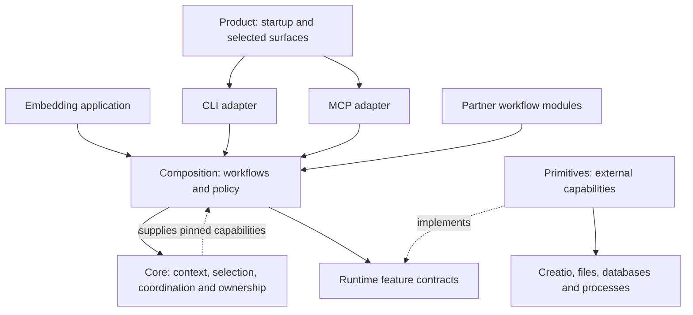
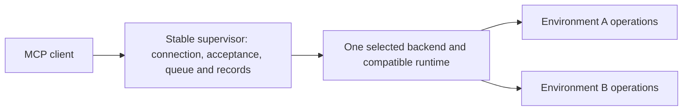
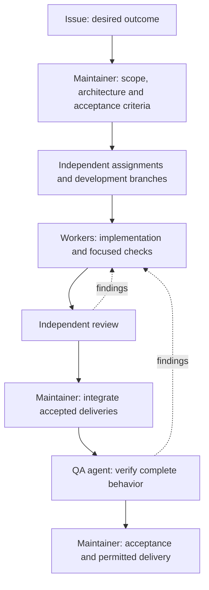

# Clio 10: architecture for contributor review

## 1. The concerns we address

Clio needs to grow without making every new workflow, integration or delivery mechanism a change to the whole application. The architecture must serve CLI users, agents, embedding applications and partners while keeping execution understandable and testable.

| Concern | What we need from Clio 10 |
|---|---|
| A change is difficult to place and assess when command policy, external I/O, hosting and presentation are intertwined. | Clear responsibilities and dependency rules. A contributor should know where a change belongs and which consumers it can affect. |
| Testing a workflow through a complete executable or environment makes ordinary policy changes expensive to verify. | In-process workflow tests using controlled capabilities, backed by integration tests where external behavior matters. |
| Applications and partners need Clio behavior without inheriting its CLI, MCP server or entire implementation. | Reusable Core and Composition libraries, optional adapters, and an explicit extension contract. |
| Partner-specific sequences can otherwise lead to vendor forks or edits to a central command dispatcher. | Independently registered workflows that reuse supported capabilities and work through the existing adapters. |
| Long-running agent sessions can miss new functionality and fixes. Windows can prevent an in-place tool update while the old process is running. | Versioned delivery that preserves owned work and makes the restart boundary explicit. |
| A response can finish before the work does. Replacing a process can lose both local execution and the record used to explain its outcome. | Explicit operation ownership, truthful status, and separate treatment of response, outcome, cleanup and evidence lifetime. |
| Runtime updates and concurrent settings changes can expose a combination that was never intended to run together. | One selected runtime/configuration pair per operation, with safe preparation, admission and retention. |
| More contributors and agents create more opportunities for overlapping edits and unclear ownership. | Modules that can be assigned independently, a named owner for shared contracts and integration, and evidence-based review. |

These concerns are broader than hot updating. The design should remain useful when an application disables updates entirely.

**Review status — revised 22 September 2026.** This revision incorporates Kirill's direction following the first contributor review and the queue-and-drain experiments. It supersedes the earlier published draft for architectural review. The selected hosting and recovery boundaries below are the design to validate, not a claim of completed implementation, contributor consensus or production readiness. Throughout this document, a *design choice* describes intended behavior; *prototype evidence* describes behavior exercised in bounded implementations. They are not interchangeable.

## 2. The proposed architecture

The ordinary execution path is short:

> An adapter or embedding application invokes a workflow. Composition decides the steps. Core supplies a context pinned to a compatible runtime and configuration. Primitives perform external work. The caller receives a structured result.

There is no process boundary between these layers in ordinary library use. A supervisor is a hosting option for the long-lived MCP product, described separately below.

*The diagram shows invocation and registration relationships. The dependency rules below define which projects may reference each other.*

| Component | Owns | Must not become |
|---|---|---|
| **Product** | Startup, chosen adapters, configuration of the host and shutdown. | A catalog of command implementations. |
| **Adapters** | CLI parsing or MCP transport, protocol argument conversion, serialization and presentation. | Workflow orchestration or direct primitive access. |
| **Composition** | Operation metadata, validation, business sequencing, interpretation of external responses and partial outcomes. | A second environment store, runtime selector or I/O layer. |
| **Core** | Environment resolution, compatible runtime selection, execution context, shared coordination and ownership. | A service that knows every feature or depends on CLI/MCP and concrete SDKs. |
| **Primitives** | Reusable external capabilities: HTTP, filesystem, database or process work. | The policy deciding an entire deployment or business workflow. |
| **Host contracts** | The small shared language for invocation, lifecycle, identity and portable data across the runtime boundary. | A collection of every feature interface. |
| **Runtime feature contracts** | Typed capability interfaces and feature data used by a matching Composition/Primitives release. | A permanently frozen host API. |
| **Runtime entry point** | Wiring the compatible release's workflows and primitives to the existing Core. | Another Core or another coordination authority. |

A primitive may perform several low-level calls to implement one useful capability. It need not wrap a single HTTP verb. Composition decides why and when that capability is used.

The important dependency rules are:

- Core depends on host contracts and general hosting infrastructure, not concrete primitives, feature implementations or transport SDKs.
- Adapter projects consume Composition. An application can consume Composition without referencing the CLI or MCP adapter.
- Workflow code consumes declared capabilities. Composition's setup code may register concrete defaults; that does not permit workflow code to reach around the capability boundary.
- Feature interfaces belong to the runtime that uses them. Complete-runtime loading shares the host contracts, not arbitrary feature assemblies from the installed host.
- Vendor workflows have no dependency on partner workflows. Adding a workflow should not require editing Core or adding command-specific adapter dispatch.

Core's access to its own settings and runtime files is infrastructure work. The rule placing external I/O in primitives applies to application work, rather than prohibiting Core from loading its own configuration.

## 3. What contributors and partners build

A feature normally consists of operation metadata, a Composition workflow and tests. It adds a primitive only when an external capability is missing.

For example, a partner can implement a workflow that inspects two files, compares their contents and conditionally invokes another supported operation. The partner registers its metadata and scoped handler through DI. The same operation becomes available to managed callers and the generic CLI/MCP discovery and execution surfaces. The vendor does not add a reference to the partner module.

The existing `verify-file` pilot illustrates the other case: a missing file-hashing capability justified one new primitive and a workflow that validates the requested digest and interprets the comparison. It reused the adapter machinery. This is evidence for a bounded development path, not proof that arbitrary plugins can be installed or upgraded independently.

The initial execution model remains deliberately constrained: one target and one pinned context per root, with sequential child workflows borrowing that context. Capability requirements are declared and checked. A host may serve independent roots for several environments concurrently; this does not turn one root into a multi-target workflow or imply concurrent child workflows or cross-process resource scheduling.

**Two supported design modes must remain distinct:**

| Mode | How it is consumed | Compatibility responsibility |
|---|---|---|
| Static typed embedding | An application references the appropriate libraries and matching feature contracts. | The application and its dependencies are built and released against those APIs. Downloading a runtime cannot change the application's compiled interface. |
| Complete-runtime invocation | The host invokes through stable host contracts; Composition, primitives and feature contracts travel together. | The host checks the release's declared compatibility. Partners packaged into that runtime target its feature APIs. |

Both assume trusted in-process code. Neither provides an untrusted-code sandbox. Independent partner-package discovery and version solving are not part of the current proposal.

## 4. Execution, state and failure ownership

The central rule is that **the component owning work must keep its execution resources alive until that work and its required cleanup finish**. A returned response is not evidence that ownership has ended.

An operation is admitted against one committed runtime/configuration selection. Its identity, selected version and configuration identity remain attached to it. Later activation changes what new operations receive; it does not silently move an existing workflow onto new code or settings.

Three events are distinct:

1. **Response:** the caller receives a result or an operation ID to query later.
2. **Outcome publication:** the actual known execution outcome becomes available.
3. **Ownership release:** the operation and required cleanup no longer need the retained resources.

An operation can publish its outcome while still retaining ownership for cleanup. Replacement decisions therefore follow ownership, not just open requests or terminal statuses.

| State | Responsible owner and boundary |
|---|---|
| Runtime/configuration selection | Core admission boundary publishes and captures one coherent pair. |
| Configuration values, migration and candidates | Settings owner controls their meaning and lifecycle; the ledger stores opaque identity. |
| Running work and required cleanup | Operation ownership retains the selected execution resources. Process-backed owners also require a usable liveness signal. |
| Outcome records and persistence health | Host/Core ledger. In supervised hosting, the supervisor owns admission, selected identities, queue, dispatch and outcome records; the backend reports execution outcomes and cleanup release. These remain Core hosting responsibilities, not adapter business logic. |
| Transport connection and presentation | Adapter or supervising host. A surviving connection does not itself preserve execution. |

Across dynamically replaceable boundaries, results and errors use host-owned portable data. A runtime-defined DTO, exception or delegate held by the caller can retain the runtime. Static typed embedding has a different lifetime agreement and must not be presented as equivalent to unload-safe dynamic invocation.

**Failures remain truthful.** A lost response does not prove that an external action failed. HTTP acceptance does not prove completion or readiness. A known success is not changed to failure merely because recording it failed. Local executor death can establish `Unknown` for unfinished work, but it cannot prove rollback or absence of remote effects. A known terminal outcome is preserved.

Where a host provides persistence, its health is reported separately. The demonstrated recovery direction is to re-persist the original outcome when possible, or explicitly acknowledge evidence loss. Repair does not re-execute the operation. Simply clearing a degraded flag does not make missing evidence durable. This is distinct from the supervised mode's intentionally in-memory queue and records, whose restart boundary is described in section 6. No automatic replay is inferred from `Unknown`, missing history, an existing artifact or a last-result endpoint.

## 5. Settings are part of the selected execution context

A workflow must not read whichever settings happen to be current halfway through its execution. It keeps the snapshot under which it was admitted.

The integrated experiments established the following boundaries:

- Prepare a settings candidate without exposing it as the committed runtime/configuration pair.
- Validate the runtime and settings, then publish one coherent selection for admission. Sequentially changing two independent “current” values is insufficient.
- A refused runtime or failed settings commit leaves the previous selection usable.
- Detect conflicting edits against the revision originally read. Rollback changes the selected data without rewinding the concurrency revision.
- Store genuinely immutable values; an `IReadOnlyDictionary` over a mutable dictionary is not sufficient.
- Retain snapshots for every relevant reason: current configuration, committed selection, active operation, pending candidate and explicit rollback retention.

Credentials remain a separate resolution concern. A snapshot without a password property is helpful but cannot prevent arbitrary string values from containing secrets. The credential lifecycle, migration policy and sensitive-data retention need explicit product rules.

These mechanisms have joint-fixture evidence. They have not yet been integrated into a complete replacement for Clio's production settings behavior.

## 6. Updating code without losing the work

### Complete runtimes

The activation unit is a compatible complete runtime: Composition, primitives and their feature contracts. This avoids independently updating pieces that must agree on their types and behavior.

The original prototype demonstrates V1 work finishing with V1 while later calls use V2, new operations behind stable discovery/execution tools, and reuse of a downloaded runtime after an offline restart. Feature-interface changes can remain inside that release without changing the host ABI.

Runtime files must remain available while owned work may still need them. Loading from streams does not make early deletion safe; lazy dependencies can still be needed. Conversely, path loading does not make eventual reclamation impossible. Ownership, escaped references and actual unloading determine when reclamation is safe. Automatic production cleanup is not established by the original updater prototype.

### Long-lived MCP hosting

For long-lived MCP sessions that need backend updates without reconnecting, the selected design is an **optional stable supervisor with one executing backend at a time**. One backend can serve independent operations against several environments. The unit being replaced is the shared Clio backend, not a Creatio environment. Ordinary CLI and embedding use do not require supervision.

The update flow is:

1. **Prepare and check the candidate.** Validate host/runtime/settings compatibility and the environment package requirements for the targets and capabilities the supervised session is committed to serving. If requirements are not met, keep the current runtime and configuration, leave service open and identify the blocking requirement and environment. An unrelated registered environment does not automatically belong to this session's update scope. The precise scope declaration and compatibility check remain implementation work.
2. **Establish a generation cutoff.** Stop accepting additional old-generation work. Already accepted old work stays bound to its original runtime and settings. Explicitly compatible new-generation requests may enter the bounded waiting queue; stale callers receive the current accepting generation and contract. Acceptance is not unconditional and does not promise eventual execution.
3. **Drain the old generation.** Finish its accepted backlog, running operations and required cleanup across all participating targets. Independent environments may make progress concurrently. Serializing supervisor decisions does not require serializing whole operation lifetimes.
4. **Replace and resume.** After ownership is released, stop the old backend, start the candidate, validate readiness without side effects and release its compatible waiting work. No running operation is migrated and no second backend executes concurrently in this hosting mode.

If work cannot drain within the configured budget, keep the old backend, resolve waiting candidate-generation requests as `NotStarted`, and reopen old-generation acceptance. Do not kill running work, replay requests or silently retag them onto another generation. A finite backlog can still contain hung work.

**Staying on the old runtime is an ordinary outcome.** If V2 requires an additional package that B does not have, A and B remain on V1. Waiting for busy work and refusing an incompatible candidate must have distinct reasons: elapsed time alone cannot satisfy a missing package requirement. This mode deliberately accepts a shared update boundary; retaining multiple runtime versions on disk does not imply running a separate backend generation for each environment. Independent per-target upgrades would be a separate requirement, not machinery needed to keep V1 available.

If replacement startup fails, a bounded fallback may try the retained previous version. That attempt can also fail, in which case the host must report unavailability. Bounded attempts are not a guarantee of a particular outage duration.

**Supervisor failure and restart.** The queue and outcome records in this mode are in memory. Acceptance explicitly lasts only for the supervisor's lifetime. Losing the supervisor interrupts all environments served by that session and can lose pending work and records; restart/reconnect restores service, not the previous operation history. The caller must treat an old operation whose record was lost as unknown, never as proof that it did not execute. Read-only requests can generally be retried; requests with side effects require reconciliation or an explicit safe-to-repeat contract. The supervisor does not replay them automatically. Durable acceptance and transparent supervisor recovery are not required by this design.

**Keep the supervisor small through normal design and code review.** Its responsibility is acceptance, queueing, dispatch, records and backend lifecycle. Feature workflows remain in the runtime. Queue limits, timeouts and drain budgets can be ordinary configuration; they do not justify a general policy-description framework. Information required before candidate startup must be available without executing that candidate. Supervisor code will occasionally change and require its own restart/reconnect; the design accepts that boundary rather than promising every fix can be delivered without reconnecting.

A separate earlier fixture showed a real MCP client remaining connected through a drain-first backend replacement and querying the original outcome. The later queue fixture demonstrated two targets, overlapping owned lifetimes, shared drain/deferral and distinct outcomes after backend loss. Neither shows execution continuing inside a killed process. The later fixture uses synthetic targets and has not exercised real environment-package compatibility checks or supervisor recovery.

The in-process runtime and supervisor experiments establish complementary boundaries. Their existence does not prove that a finished product has integrated both mechanisms, settings, recovery and all Clio operations together.

### Discovery and trust

Stable discovery/execution tools let the host expose new operations without redefining resident tools. A runtime-generation marker can help a client notice changes, but correctness must not depend on an agent choosing to rediscover. Every invocation still needs validation and explicit incompatibility results; stale-generation rejection identifies the current accepting contract so callers can adapt deliberately. This is not proof that every existing client will automatically adapt.

Production acquisition requires trusted publisher/source rules and verification. HTTPS, package compatibility and a hash obtained from an untrusted source are not enough. The experiments do not implement or approve a production trust policy.

## 7. Testing and contributor workflow

| Change | Primary verification |
|---|---|
| Workflow policy | In-process Composition tests with controlled primitive responses, including failure, cancellation and partial acceptance. |
| External capability | Primitive integration tests and selected real-system checks. |
| Selection, coordination or lifetime | Core tests with explicit ownership and concurrency conditions. |
| CLI/MCP behavior | Adapter and real protocol tests, including consumer compatibility where applicable. |
| Packaging or updates | Installed-product tests using actual release artifacts. |

Test selection must follow transitive dependencies. A shared contract or lifetime change can affect many modules even if only one file changed. **Selective CI is not implemented or measured**; cleaner boundaries make it possible but do not supply it automatically.

The experiments repeatedly found cases that passed without exercising the property in their title. Concurrency needs observed overlap; load tests need established load; negative controls must actually build, execute and fail. Joint tests are essential because a correct fix in one module can accidentally mask the failure another module's test was intended to detect.

Contributor ownership follows the same boundaries. Agree shared contracts before independent implementation, assign one owner to shared registration and integration files, and review each delivery against its responsibility and evidence. Human and agent contributors follow the same rules. The team pilot supports this workflow at a small scale; it does not establish large-team throughput or automatic enforcement of every boundary.

## 8. Agentic development with limited human oversight

The proposed development model gives Clio a dedicated **maintainer agent**, exposed to contributors through a GitHub App. It coordinates both human and agent contributions and remains accountable for each issue through acceptance and delivery. Clear layers, reusable capabilities and focused tests let it delegate bounded work without requiring a human to supervise every implementation choice.

The maintainer refines an issue against the architectural requirements, identifies affected layers and agrees acceptance criteria with an independent QA agent. It creates sub-issues for genuinely independent deliverables, establishes shared contracts and assigns ownership. Small changes remain a single task.

Workers implement their assigned pieces and run focused checks. Independent reviewers assess correctness, architectural fit and the quality of the evidence. The maintainer coordinates corrections and integration; a worker reporting completion does not mean the issue is accepted.

Branching follows the delivery boundary. A small, independently complete change can reach `master` through a reviewed PR. Dependent contributions join a feature integration branch and reach `master` only after the complete feature is verified. Stacked PRs are an option when dependencies justify them, not a requirement for every task.

**Verification is delegated; accountability stays with the maintainer.** The QA agent verifies the integrated build against the original acceptance criteria in an exclusively owned disposable Creatio environment, or another environment appropriate to the task. It reports evidence for the exact build tested. The maintainer resolves findings and completes delivery only when the required checks and reviews pass under the agreed merge policy.

Repository code and approved architecture define the working contracts. GitHub issues, PRs and checks track assignments, delivery and acceptance. Durable task records preserve execution progress across agent restarts. The knowledge graph preserves consequential findings, constraints, decision rationale and their evidence, so future work can recover relevant context without reconstructing a long conversation.

**Agreed graph ownership:** the maintainer is the sole automated writer. Workers and reviewers have read access and submit proposed findings, supporting evidence and challenges through the maintainer. The maintainer reconciles these contributions, records dependencies and corrections, and marks superseded conclusions while preserving their history. Access permissions must enforce this separation; human administrators retain correction and recovery access.

Graph entries preserve attribution, scope and status, distinguishing proposals, disputed findings and approved decisions. Reviewer objections and their original evidence remain independently visible in issues or review threads even when the maintainer disagrees; sole graph write access does not make the maintainer the sole authority on evidence. Recording a claim does not authorize it. Before closing an issue, the maintainer records knowledge useful to future work and reconciles conclusions invalidated by the change. Routine progress and minor implementation choices remain in task records. This makes the graph engineering memory rather than a second project-management system.

Humans set outcomes, architectural principles and the agent's standing authority. Agents handle routine planning, implementation, review and repair within those boundaries. Changes to architectural boundaries, compatibility commitments, trust or authorized environment access require escalation; ordinary implementation decisions do not. This model is proposed: the existing pilot provides limited supporting evidence, not proof of an autonomous delivery system.

## 9. What exists, and what this review can approve

There are three different levels of maturity:

| Level | Current position |
|---|---|
| Layered Clio 10 prototype | Reusable projects, generic adapters, partner examples and installed-runtime delivery proofs exist. The migration ledger lists 21 partial legacy ports plus the separate `verify-file` pilot. This is not Clio 8 parity. |
| Focused and joint experiments | Retirement, ownership, persistence, liveness, settings and handover have bounded evidence. The runtime/settings joint fixture reports 13/13 on macOS and Windows. The separate generation-queue fixture also has 13 cases, Windows/macOS peer reports and mutation checks; these are different suites, not cumulative product coverage. |
| Production Clio 10 | Full integration, compatibility coverage, trust controls, operational policies and migration remain work. No production release or wholesale port is implied. |

The recommended contributor decision is to endorse the responsibility boundaries and the small execution model, then integrate and migrate through complete feature slices. Do not copy the legacy dependency structure into new project names or treat every experimental helper as a permanent framework.

The following starting positions guide implementation planning; remaining specifications do not imply that their mechanisms have already been built:

| Decision | Recommended starting position | What remains to specify |
|---|---|---|
| Hosting | Optional supervision with one executing backend shared by participating environments; keep V1 when V2's requirements are unmet. Supervisor changes use restart/reconnect. | Participating target/capability scope, candidate compatibility evaluation and supported deployment combinations. |
| Interruption | Generation cutoff and bounded drain; defer without killing or replaying when work will not drain. | Budgets and operator controls; distinguish busy drain, incompatible candidate and failed startup. |
| Evidence | Supervised acceptance and records last for the supervisor's lifetime. Restart/reconnect does not prove whether lost operations executed. Preserve known outcomes while their evidence owner survives. | Retention, sensitive data and recovery guidance. If another mode promises persistence, define its durability, degradation and repair contract separately. |
| Settings | Immutable per-operation snapshots and coherent runtime/configuration selection. | Schema migration, edit conflicts, drift, credential access and retention policy. |
| Extensions and acquisition | Trusted in-process extensions and complete compatible releases. | Supported partner packaging, publishers, verification and distribution controls. |
| Migration | Incremental behavioral ports with explicit differences and consumer tests. | Feature order, legacy CLI/MCP compatibility commitments and release gates. |

These are review decisions with recommended defaults, not missing mechanisms that should trigger another open-ended experiment round.

The simplicity test is whether a maintainer can still explain an ordinary operation as **one workflow, one selected context, declared capabilities and a structured result**. Additional machinery is justified only where it protects that flow: coherent admission, retained ownership, truthful evidence or safe replacement. The design does not require a general workflow engine, distributed transaction system, per-capability package solver or automatic replay framework.

## Appendix: evidence used for this draft

The evidence references below support the bounded claims above. Test counts belong to their stated revisions and environments; they are not cumulative product acceptance. This draft involved document and graph review, not new test execution.

| Area | Evidence and qualification |
|---|---|
| Layering and original update proof | [Prototype principles](https://github.com/Advance-Technologies-Foundation/clio/blob/089de2a75dec228564a150f6f719d9052ea3dcc3/docs/architectural-principles.md), [runtime proof](https://github.com/Advance-Technologies-Foundation/clio/blob/089de2a75dec228564a150f6f719d9052ea3dcc3/docs/runtime-update-proof.md), [feature-contract boundary](https://github.com/Advance-Technologies-Foundation/clio/blob/089de2a75dec228564a150f6f719d9052ea3dcc3/docs/primitive-contract-boundary.md). Historical source and installed-product evidence; later lifecycle work is separate. |
| Managed retirement | [E2 at a72fae8ea](https://github.com/Advance-Technologies-Foundation/clio/tree/a72fae8ea62ee9dcddc757014b686811306a94d4/experiments/RuntimeRetirement), [macOS reproduction](https://github.com/Advance-Technologies-Foundation/clio/discussions/1643#discussioncomment-18540361). Eight managed cases; no native/resource or exhaustive concurrency claim. |
| Lease repairs | [Codex Windows evidence at aebcea989](https://github.com/Advance-Technologies-Foundation/clio/tree/aebcea989/experiments/DetachedOperations), upstream `0aff304a7d14b502953cd301f87baa2f748e1f31`. Historical independent 33/33 run; later peer extensions have their own evidence. |
| Persistence and portable values | [Repair/loss and hung-work report](https://github.com/Advance-Technologies-Foundation/clio/discussions/1643#discussioncomment-18543530), [portable-boundary report](https://github.com/Advance-Technologies-Foundation/clio/discussions/1643#discussioncomment-18543568). Peer-reported fixtures, with later reference-direction qualifications retained. |
| MCP handover and liveness | [Real client report](https://github.com/Advance-Technologies-Foundation/clio/discussions/1643#discussioncomment-18543918), [mutation findings](https://github.com/Advance-Technologies-Foundation/clio/discussions/1643#discussioncomment-18543950), [ProcessOwner repair](https://github.com/Advance-Technologies-Foundation/clio/discussions/1643#discussioncomment-18544163). Drain-first continuity; older bare-Process supervisor paths are not covered by that repair. |
| Final joint flow | [13/13 platform results](https://github.com/Advance-Technologies-Foundation/clio/discussions/1643#discussioncomment-18545362), tested `4f31da748308` with settings `62fb98e05736`; [corrected reference narrative](https://github.com/Advance-Technologies-Foundation/clio/blob/4e7f622b7d8a/experiments/JointIntegration/reference-flow.md). Peer results accepted as team evidence, not rerun for this draft. |
| Queue-and-drain hosting | [Original 10-case proposal](https://github.com/Advance-Technologies-Foundation/clio/discussions/1643#discussioncomment-18552589); [two-target slice and evidence](https://github.com/Advance-Technologies-Foundation/clio/blob/1d61e0c08f98eb8f657a7f666ddf150c8eec0b54/experiments/GenerationQueue/MULTI-ENVIRONMENT.md). Codex measured 13/13 on Windows and three failed negative controls. Synthetic targets and fixed configuration labels; no production package-compatibility gate, real Creatio I/O, credential isolation or N-target scalability proof. |
| Independent challenge of queue slice | [Alex's Windows reproduction and correction](https://github.com/Advance-Technologies-Foundation/clio/discussions/1643#discussioncomment-18553093), [Vova's macOS reproduction and concerns](https://github.com/Advance-Technologies-Foundation/clio/discussions/1643#discussioncomment-18553156), [Claude's read-only review](https://github.com/Advance-Technologies-Foundation/clio/blob/c0757a2b1ac3274e3a87c0bb7fe5570b0d669fb7/experiments/GenerationQueue/CLAUDE-REVIEW.md). Alex reports the full verifier; Vova reports 13/13 and both new controls. Claude ran no tests. Timing-window and result-label qualifications remain in the review. Peer reproduction does not approve the product policies selected in this revision. |
| Partial migration and team pilot | [Migration ledger](https://github.com/Advance-Technologies-Foundation/clio/blob/089de2a75dec228564a150f6f719d9052ea3dcc3/docs/porting/README.md), [team guide](https://github.com/Advance-Technologies-Foundation/clio/blob/089de2a75dec228564a150f6f719d9052ea3dcc3/docs/agent-team.md), [pilot record](https://github.com/Advance-Technologies-Foundation/clio/blob/089de2a75dec228564a150f6f719d9052ea3dcc3/docs/agent-runs/verify-file.md). Partial behavior and one pilot, not full parity or scale validation. |

The supporting research index is `clio/discussions/1643`; revision 207 records the queue review before the decisions incorporated here. Subsequent decision and publication records link this revised document. Source history preserves retractions and superseded claims. The dated continuation in `architecture-experiments.md` connects the original round conclusion to this revision without rewriting the historical evidence.
