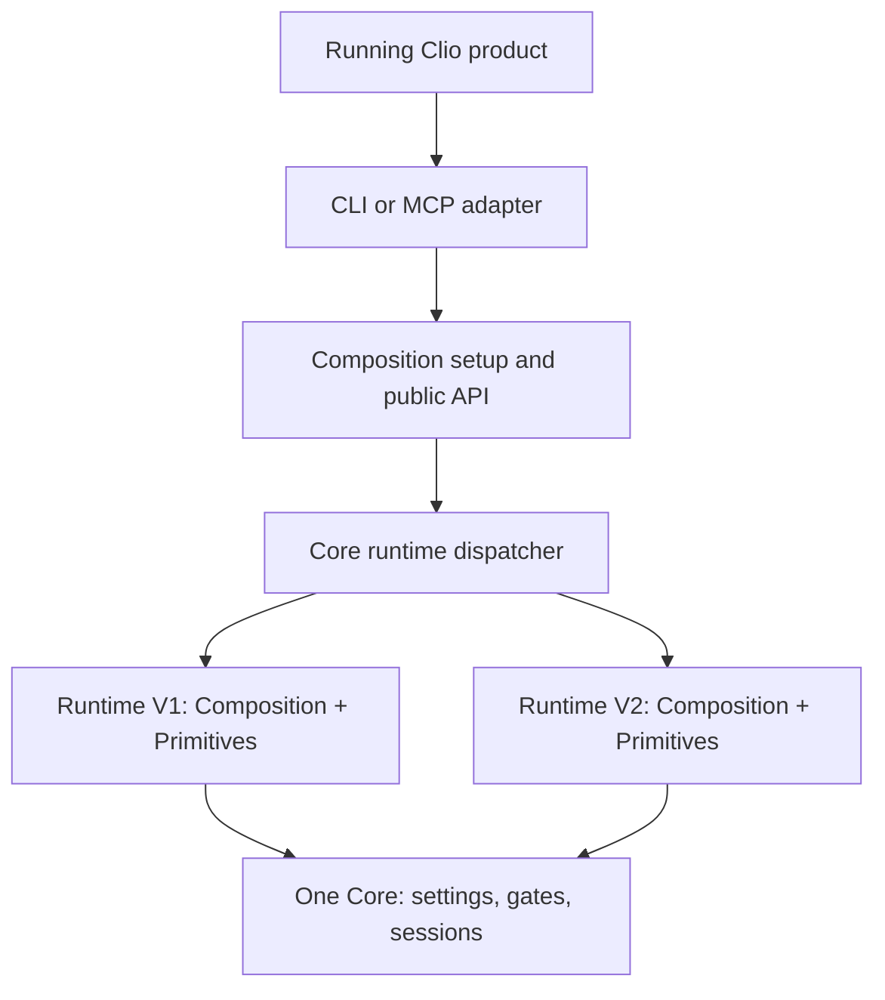

# Complete runtime update proof

The [feature-interface evolution proof](primitive-contract-boundary.md) extends this proof: a host that never referenced the feature assembly loads V2 with a new capability and V3 with a breaking capability API, over the same MCP connection.

## Decision and scope

The update unit is now a **complete runtime release: Composition workflows plus primitives**. The host process, Core, Contracts and transport adapters stay running. This extends the earlier [primitive-only proof](auto-update-proof.md); it does not replace the running executable or change resident MCP tool definitions.

The earlier primitive boundary could fix external calls but could not deliver a new workflow. A release entry point now implements `IRuntimeBundle`, creates its Composition through `OpenComposition(ICompositionHost)`, and supplies primitives through the existing bundle contract. Only Contracts and BCL types cross the loading boundary. This small entry point is packaged in `src/Runtime`; it contains default wiring, not workflow policy or external I/O implementations.



The dispatcher captures one loaded Composition before invoking it. Core gives that Composition a host view pinned to the exact bundle object. Consequently V1 cannot acquire V2 primitives between steps, and nested calls use V1's workflow registry and dependency scope. All releases borrow the original Core's environment resolver and gates; the private runtime container must never install another Core.

## What changes and what stays stable

- `Contracts/Runtime.cs`: borrowed execution host, complete runtime factory and owned Composition contracts. Infrastructure error/context types also live in Contracts so independently loaded code shares their type identity.
- `Core/UpdatingComposition.cs`: select, retain and dispatch to complete runtime releases. Factory activation can fall back before execution. Execution errors never replay on an older release.
- `Core/ClioCore.cs`: bound host views preserve the existing target coordination and session lifetime.
- `Composition`: vendor workflow registration is reusable without registering Core or an updater. Workflows retain their existing execution model.
- `Runtime`: owns the release's private DI container and standard Composition/Primitives assembly wiring. Partners can be registered in this release container.
- Adapters: opt into complete-runtime selection through configuration; no command-specific routing or workflow knowledge is added.

Complete runtimes declare primitive ABI 2 and runtime factory ABI 1. The host selects a 10.x release with matching metadata, and checks the actual loaded factory before use. The manifest, entry assembly and NuGet package versions must match. The supplied Contracts assembly identity must match the running host before publication or activation. Its AssemblyVersion is deliberately pinned independently of package release versions; changing that ABI requires a host upgrade. Workflows must accept their own bundle version and capabilities. These are declared compatibility checks, not behavioral equivalence.

Static embedding remains available. Dynamic mode intentionally rejects host-registered workflow metadata both before and after setup instead of silently ignoring it: package those workflows with the runtime. Separate plugin-folder acquisition and independently updated partner modules remain outside this proof.

## Execution proof

The product test uses real DLLs, a NuGet V3 loopback feed, a controlled Creatio HTTP server, and one MCP SDK connection to the shipping product:

1. Start V1 and hold its first restart request.
2. Publish V2 to the feed while V1 remains active.
3. Discover V2's new `runtime-added` operation through the existing `list-operations` tool.
4. Queue a V2 root. It must wait on the same Core gate while V1 owns the target.
5. Release V1. Its original restart-then-flush sequence finishes with V1 children.
6. V2 executes its changed flush-then-restart sequence. This proves changed workflow policy, not just changed version metadata.
7. Invoke `runtime-added` through the existing `execute` tool on the same pipe and PID.
8. End the process only after proving the switch. With the feed stopped, a fresh process runs the new operation from the persistent cache.

The same proof also runs with a stalled first download, exercising the 30-second whole-check deadline and later recovery. Core tests cover factory fallback, no execution retry and exactly one composition disposal. The existing primitive acquisition rejection tests remain applicable to the same downloader.

## Reproduce and package

```powershell
dotnet test tests/Clio10.Product.Tests/Clio10.Product.Tests.csproj -c Release --filter FullyQualifiedName~Update_keeps --logger 'console;verbosity=normal'

# Normal reusable runtime output (vendor restart and flush workflows):
dotnet build src/Runtime/Clio10.Runtime.csproj -c Release -p:Version=10.1.0
./scripts/pack-primitive-bundle.ps1 -BundleDirectory src/Runtime/bin/Release/net10.0 -Version 10.1.0 -PackageId Clio10.RuntimeBundle

# Controlled proof payload, including the changed and newly added workflows:
./scripts/pack-primitive-bundle.ps1 -BundleDirectory artifacts/runtimes/10.1.0.0 -Version 10.1.0 -PackageId Clio10.RuntimeBundle
```

The existing packing script accepts either complete payload; no new package download protocol or package manager is introduced. A reusable library NuGet and a complete loader payload remain different artifacts. A host consumes `Clio10.Composition` normally; an updater consumes the payload package.

Set `CLIO10_RUNTIME_COMPOSITION=true`, `CLIO10_BUNDLES` to an explicit cache seeded with a complete runtime, and the existing update source/package/interval settings. Use `CLIO10_UPDATE_PACKAGE=Clio10.RuntimeBundle`. Prefer a dedicated cache per release family. When migrating from primitive-only mode in the same cache, an occupied numeric version directory is preserved and the complete runtime uses a package-suffixed directory; each mode filters the other mode out of selection. MCP owns the background timer; a CLI invocation selects the installed runtime but does not start a timer. Managed hosts set `CompositionOptions.RuntimeComposition=true` and supply the same settings explicitly.

## Limits that remain

This is trusted in-process code, not a plugin sandbox. Updates require a trusted direct NuGet V3 source; redirects, private-feed authentication and package signing are not implemented. Bad acquisition leaves the existing release callable; no exactly-once retry or rollback of external effects is claimed.

Old loaded releases stay alive until shutdown, including their Composition containers. Repeated updates therefore consume additional memory and disk. Automatic unloading and cleanup are separate work. The hosting application must drain calls before disposing Core.

New operations behind the stable discovery/execute tools work without redefining resident tools. Whether an agent independently chooses to rediscover them is client behavior; this proof uses an MCP SDK client, not a claim about Codex UI schema refresh. Core/Contracts/adapter upgrades still require a product restart. Settings migration and cross-process coordination are unchanged and out of scope.

## Verification evidence

- Final source regression: **131 tests passed** (Composition 43, Core 35, Primitives 9, Product 44).
- Actual local NuGet install: `artifacts/packages/clio.10.0.0-preview.11.nupkg`, installed under `artifacts/tool-preview11` without changing the global tool.
- Installed product: **24 acquisition/update and shipping CLI/MCP checks passed**, using the actual `Clio10.RuntimeBundle.10.1.0.nupkg` from `dotnet pack`.
- Installed stalled-download run: MCP PID **25320** completed V1 work and then V2 work on the same connection. Fresh offline PID **2740** executed the V2-only operation.
- Inspectable cache: `C:\Users\k.krylov\AppData\Local\Temp\clio10-update-adcbb3e9-9d11-4d66-ab25-31454813de52`.
- The installed CLI's `--list` with complete-runtime mode and `artifacts/runtimes` discovers `runtime-added` from V2.
- Logs: `artifacts/runtime-regression-final.log`, `artifacts/installed-runtime-proof-final.log`. The tests include both original vendor commands, missing-cache/configuration errors, Contracts mismatch, mixed-mode cache collision, factory fallback and exact pins.
- Docs and MCP reviewed. Existing resident tool names and argument schemas remain unchanged; resolution error codes are now preserved. No Clio 8 or Ring-consumed contract was changed.

KISS check: a background timer acquires one immutable payload; the existing catalog selects it; a small dispatcher holds one composition per release; each composition borrows the same Core. No process proxy, custom wire protocol, second Core, automatic unloading, dependency solver or additional scheduler is introduced. Runtime wiring is a separate release project because workflows and primitives must travel together without making the product or Core depend on their concrete implementations.

## Independent review and corrections

Claude review `rev_e3b2799fc33345e3` found no blocking defect in release pinning, nested scope ownership, shared Core coordination or pre-execution-only fallback. It identified advisory failure-handling gaps, which were corrected and regression-tested locally:

- CLI/MCP discovery preserves Core resolution codes; malformed runtime configuration exits with code 2 instead of an unhandled startup exception or an uncertain execution result.
- Primitive-only and complete-runtime installations at the same version can coexist without overwriting loaded files or preventing the updater from publishing the other mode.
- A payload compiled against a newer Contracts ABI is rejected before publication and local activation. Contracts assembly identity is explicitly versioned independently of runtime packages.
- Host-registered workflows are rejected in either registration order.
- Tests cover incompatible runtime manifests/factories, primitive-only factories returned by custom catalogs, exact-pin activation failure and no execution retry.

The full review is retained in `artifacts/reviews/rev_e3b2799fc33345e3.md`. Claude's review was read-only and did not run tests; test results are local verification by the implementing agent. These advisory fixes did not trigger another full review.
