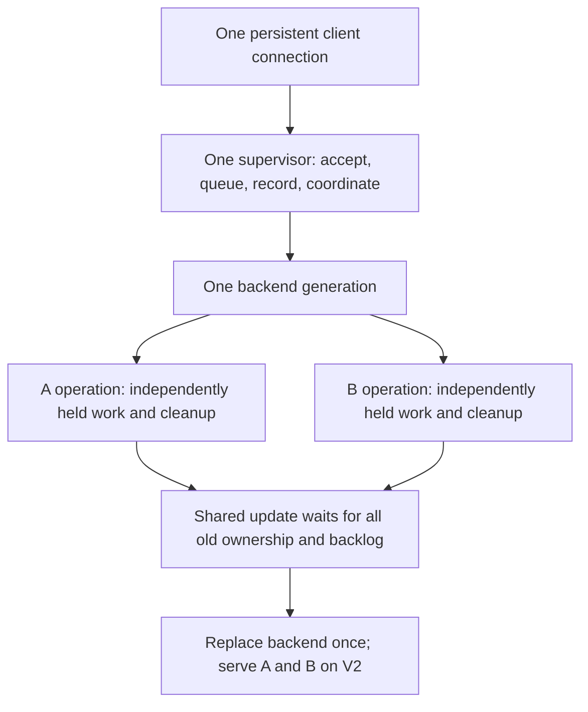

# Two environments, one shared backend

## Architectural question

Does supporting two environments require a supervisor per environment, or can one coordinator preserve safe acceptance and replacement while independent work overlaps?

This slice uses **one supervisor, one executing Clio backend and two simulated environments, A and B**. Each operation still belongs to exactly one target. The update replaces Clio's shared execution process; it does not update either Creatio environment.

## Deliberately small design

The existing queue now carries a target alongside its generation. The supervisor tracks one owner per target instead of one owner globally. It dispatches eligible work for an idle target even when the other target is busy. The same single event loop still makes admission, dispatch and replacement decisions; serializing those decisions does not require serializing the whole lifetime of all operations.

The worker retains independent operation states with explicit release signals. A can wait while B performs its effect and publishes its result. This demonstrates overlapping in-flight lifetimes, not parallel CPU throughput or real remote I/O. A single target's next request waits for that target's previous cleanup to release. No extra process, broker, lock hierarchy, or per-target updater is introduced.

**Update rule:** cutoff and drain are global to the shared backend. Already accepted V1 work for both targets stays on V1. Compatible new V2 work for either target waits. Replace only after every V1 queue entry and owner has cleared.

**Tradeoff:** a busy B can delay the shared update even when A is idle. If the drain budget expires, preserve B, resolve both targets' queued V2 work as `NotStarted`, reopen V1 acceptance and let A continue. Independent updates per target are a different requirement; this slice neither provides nor requires them.

## Evidence to challenge

- **Q11 — overlap and safe replacement:** hold A and B before either can finish; verify both have started in the same backend. Let B and its old backlog produce effects while A remains held. Publish both outcomes but retain cleanup; A's release alone cannot permit retirement while B owns cleanup. Finally release B and verify both targets' new work executes under one new backend, with exact target, generation, configuration and outcome identities.
- **Q12 — shared delay, independent progress:** hold B across the drain budget. Show A completes work before and after deferral while B is still running. Both V2 queues resolve without execution; no backend is replaced or operation replayed.
- **Q13 — shared failure:** kill the backend when A has published success but B has performed an effect without publishing an outcome. Preserve A's `Succeeded` and B's `Unknown` independently, release all local process ownership, and mark untouched A/B backlog `NotStarted`.

Two new negative controls make Q11 fail at explicit assertions: `serialize-targets` prevents B from acquiring ownership while A is held; `ignore-b-drain` allows replacement while B still owes cleanup. This prevents a sequential run or an A-only drain from passing as the intended architecture. The earlier wrong-generation fallback control remains in the reproduction script.

## Scope and decision boundary

The slice supports evaluating a shared backend as one update/failure domain serving multiple environments. Whether delaying all targets for one busy target is acceptable remains a product choice. It does not settle per-target deployment, fairness, many-target scalability, shared external resource conflicts, supervisor crash recovery or independent version requirements.

Targets are synthetic identities and effect records, not provisioned Creatio servers. Configuration labels are still fixed fixtures, not per-target credential/settings isolation proof. Admission/evidence remain supervisor-owned and volatile. Receipt wording now states `accepted-until-supervisor-exit`, and stale-generation rejections include the current generation and contract. Neither change promises durability or automatic adaptation by a real MCP client.

Run `pwsh -NoProfile -File ./experiments/GenerationQueue/verify.ps1` from the worktree. Historical single-target evidence remains unchanged. New runs produce separate source-pinned evidence bundles. No production architecture document is changed by this experiment.
