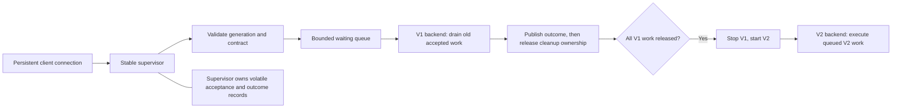

# Supervisor queue and generation handover probe

## Question and status

Can one stable supervisor keep its client connection, accept bounded waiting work, let the old backend finish its accepted requests and cleanup, then replace it without executing requests under an incompatible version?

This is an isolated, executable mechanism prototype for Kirill's queue proposal. It is not a production Clio implementation or an approved architecture change. Source lives on local branch `krylov/generation-queue-probe`, based on `089de2a75dec228564a150f6f719d9052ea3dcc3`. No public publication or peer challenge has been initiated.

## Smallest flow exercised



There is one executing backend and one operation at a time. One queue contains generation-tagged entries; a single supervisor event loop serializes admission, dispatch and replacement. No message broker, simultaneous old/new execution, or movement of running operations is needed for this fixture.

1. Before update, V1 accepts and executes V1 requests. Already queued V1 work belongs to V1 too.
2. Update establishes a finite cutoff. Newly submitted V1 work is rejected; explicitly compatible V2 requests may queue. The client can discover the accepting generation and its contract.
3. V1 completes its existing queue and in-flight work, including cleanup after publishing success. V2 cannot execute yet.
4. Only after all V1 ownership is released does the supervisor stop V1 and start V2. Once ready, V2 drains its queue. The original client pipes and supervisor stay alive; old results remain queryable.
5. A drain timeout defers replacement without killing V1. Waiting V2 requests become `NotStarted`; V1 admission resumes. V2 startup failure similarly resolves the V2 queue and attempts a fresh V1 process. If that also fails, service is explicitly unavailable.

**Acceptance is not a promise to execute eventually.** The receipt says `queued-volatile`: the supervisor has accepted the request into memory. Cancellation, expiry, update failure or deferral can resolve it as `NotStarted`. Capacity exhaustion and stale/incompatible callers get explicit rejection. There is no unconditional “always accept” guarantee.

## Deliberate prototype policies

- Caller supplies a generation and exact fixture contract (`write/v1` or `write/v2`); both supervisor and backend validate them. No accepted request is silently retagged during fallback.
- Each generation has a fixed fixture configuration (`cfg-1` or `cfg-2`). V1 writes the original payload; V2 writes uppercase, making incorrect routing observable beyond version labels.
- Queue and outcome records belong to the supervisor, in memory. Backend replacement preserves them; supervisor replacement or crash does not. Durable acceptance/recovery is outside this experiment.
- Published success and released ownership are separate events. Unknown outcome after executor loss remains `Unknown`, including when an independent side-effect file exists. No automatic replay occurs.
- The queue capacity bounds waiting entries, excluding the one running request. Waiting requests may have deadlines and can be cancelled; this fixture does not implement cancellation of dispatched work.
- Default drain budget is 5 seconds. Backend startup and fallback each have a separate 5-second budget. This is not a guaranteed outage bound. Deferred updates require a new explicit update request.
- Backend death ends local process ownership; it does not establish that remote effects or external cleanup completed.

## Reproduce

Requires .NET 10 SDK and PowerShell 7. From this worktree:

```powershell
pwsh -NoProfile -File ./experiments/GenerationQueue/verify.ps1
```

The script builds Release, runs all scenarios, runs Q2 with a deliberate unsafe fallback mutation (expected failure), restores the normal rule and reruns Q2. It captures actual native exit codes, source hashes, base commit, runtime information, TRX results, client transcripts, independent effect files and process cleanup evidence under `evidence/<UTC timestamp>/`. A script success means the mutation failed at the intended oracle, not that the unsafe code passed.

For the normal suite alone:

```powershell
dotnet test ./experiments/GenerationQueue/Tests/Tests.csproj -c Release
```

Raw per-session files are under ignored `artifacts/`; the verification script copies only its own newly created sessions into its evidence bundle. No external environment is provisioned. Teardown checks every spawned backend PID, including startup failures, and stops only exclusively owned fixture processes.

## Scenarios and oracles

| Case | Failure or behavior challenged | Independent check |
|---|---|---|
| Q1 | Old queue and post-outcome cleanup survive cutoff | Exact effect IDs/order/values/configurations, old/new worker PIDs, same supervisor, event order, retained old result |
| Q2 | Old work will not drain before budget | V1 stays running, V2 is `NotStarted`, V1 resumes, no V2 effect |
| Q3 | V2 dies before readiness | V2 never executes; fresh retained V1 serves new V1 work |
| Q4 | Candidate and fallback both fail | Explicit unavailable response and no queued V2 effect |
| Q5 | Queue full, waiting cancellation and expiry | Rejected/cancelled/expired IDs never appear in effects |
| Q6 | Worker dies before held effect | Executing request `Unknown`, undispatched backlog `NotStarted`, no replay |
| Q7 | Worker dies after success during cleanup | Known success remains, local ownership ends, exactly one effect |
| Q8 | Wrong contract, duplicate ID, missing generation | Rejection before backend effects |
| Q9 | Effect occurs, worker dies before outcome | Outcome stays `Unknown` despite one observable effect; no replay |
| Q10 | Cancel V2 while V1 drains, repeated update | Slot reusable, repeated update refused, cancelled V2 never executes |

Work, outcome and cleanup are held/released by explicit protocol handshakes. Test polling observes events; sleeps do not manufacture those concurrency boundaries. Real deadlines test expiry and drain budgets. The mutation intentionally rewrites waiting V2 work to V1 on deferral; Q2 must reject the changed status and its independent effects would also show the wrong generation executing it.

## What this can and cannot establish

A passing run supports the queue cutoff and drain mechanism for these fixture paths, using real supervisor/worker OS processes and one persistent **JSON-lines stdio** connection. It supports selecting this mechanism for further architectural consideration. It does not establish a finished Clio host or general fault tolerance.

This is not an MCP protocol/client test, a Creatio integration test, an SDK/DLL loader test, or a whole-product updater. V1 and V2 are modes of the same fixture executable, not independently packaged releases. Configuration labels are fixtures, not a tested settings migration. No durability, partial-write/fsync recovery, supervisor replacement, credential migration, publisher trust or remote-operation reconciliation is proved. Admission uses a prepared fixed descriptor; real package validation and discovery compatibility remain untested.

The work queue is bounded, but ingress and retained result history are not globally memory-bounded. Client output backpressure can delay the supervisor event loop. A client that keeps submitting stale V1 requests after cutoff is rejected; automatic client rediscovery is not implemented. Nested operations and parallel workers are not modeled. These limits should remain explicit when presenting results.

## Suggested peer challenge

Review `Probe/Program.cs` against `Tests/QueueTests.cs` and the raw evidence. Challenge whether cutoff and failure semantics satisfy the intended product behavior; whether any accepted request can disappear, run under the wrong generation or acquire a false outcome; and whether retirement can precede cleanup release. Independently reproduce the normal and mutation runs. Requests to extend transport, durability or concurrency should state the product requirement they test before adding a mechanism.

The KISS result is a supervisor-owned volatile queue and outcome ledger, a generation cutoff, and one replaceable worker. The experiment deliberately keeps the decision between durable and volatile acceptance visible instead of introducing recovery machinery implicitly.
