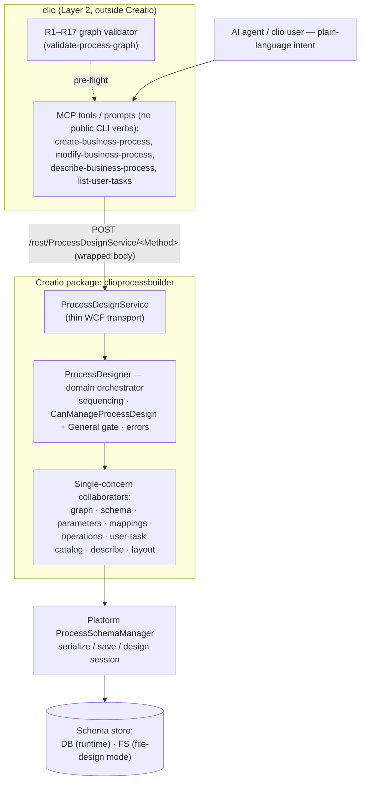

# ADR: Backend command-driven process designer (clioprocessbuilder)

**Jira**: [ENG-90883](https://creatio.atlassian.net/browse/ENG-90883) (Approach 1 of [ENG-91447](https://creatio.atlassian.net/browse/ENG-91447); follow-ups [ENG-91842](https://creatio.atlassian.net/browse/ENG-91842))

**Confluence**:
- [Research: Add business process generation via AI instructions](https://creatio.atlassian.net/wiki/spaces/TER/pages/4702928908) — three-approaches investigation; §3 records the Approach 1 + package decision
- [Backend designer — architecture & delivery options](https://creatio.atlassian.net/wiki/spaces/TER/pages/4752572418) — clio ↔ `clioprocessbuilder` split, request-flow sequence diagram, placement rationale (package vs core vs clio-only)
- [Backend designer — capability status (implemented & verified)](https://creatio.atlassian.net/wiki/spaces/TER/pages/4769087495) — per-capability matrix (works / partial / not yet built)
- [Backend designer vs UI automation — head-to-head](https://creatio.atlassian.net/wiki/spaces/TER/pages/4750180427) — Approach 1 vs Approach 3 comparison

**Companion doc**: [backend-designer-manual-qa.md](../backend-designer/backend-designer-manual-qa.md) (manual QA checklist)

**Code**: GHE `engineering/cli-process-builder` (package `clioprocessbuilder`); clio MCP layer in this repository

**Created**: 2026-06-25

---

## Context

An AI agent (and clio CLI users) must create, edit and read Creatio business processes **without** the Freedom UI visual designer — purely from a declarative intent. Creatio's process model is non-trivial: a process needs a `LaneSet → Lane` with nodes contained in the lane, sequence flows with no container, designer-faithful defaults (`Tag="Business Process"`, `IsCreatedInSvg`, `IsInterpretable`, `SerializeToDB`), user-task parameter synchronization, meta-path mapping tokens, and palette curation via `SysProcessUserTask`. The serializer/persister lives behind `Terrasoft.Core` process APIs (`ProcessSchemaManager`, `ProcessSchema*` element classes), several of which are `public` but version-fragile, and some (`*FromMetaData`) are `internal` and uncallable from a package.

Earlier explorations considered driving the visual designer over CDP (approach 3). That path is brittle (DOM/automation coupling) and cannot run headless/server-side. A durable, server-side, intent-first capability was needed.

## High-level design

_The boundary this ADR governs is the REST edge between **clio** and the **package**; everything to the right of `ProcessDesignService` runs inside Creatio and is the package repo's concern (see "Internal architecture — principle only" below). The platform `ProcessSchemaManager` owns serialization/persistence — on a DB stand a save is immediately runtime-runnable; in file-design mode it is FS-only until an FS→DB load + publish._

## Decision

Deliver process design as a **backend command-driven "non-visual designer"**, packaged as a **cliogate-style Creatio configuration package `clioprocessbuilder`** (a new sibling to `cliogate`), with a clear two-layer split:

- **Package layer (`clioprocessbuilder`, in Creatio)** — owns build/modify/read/serialize via the platform managers. Exposed as a thin WCF service `ProcessDesignService` (`[ServiceContract] : BaseService`) at **`/rest/ProcessDesignService/<Method>`** (wrapped body style; `Build()` prepends `0/` on net472). The service is a transport shell that resolves the domain orchestrator `IProcessDesigner` from a per-request DI scope (`ClioProcessBuilderApp` composition root) and delegates.
- **clio layer (Layer 2)** — owns intent/MCP/orchestration: `ServiceUrlBuilder.KnownRoute` entries, `Command<TOptions>` command classes (`create-business-process`, `modify-business-process`, `list-user-tasks`, `describe-business-process`) exposed **only** as MCP tools (no public CLI verbs — see "Feature gating"), their MCP tools/prompts/guidance, and the R1–R17 `IProcessGraphValidator` (common-core) used as pre-flight.

### Service surface
- `BuildProcess({name, caption, packageName, elements[], flows[], parameters[], mappings[]})` — declarative descriptor in; builds the lane, materializes elements, connects flows, adds parameters (optionally with a constant default value) and mappings, auto-lays-out, saves.
- `ModifyProcess({name|uid, operations[]})` — **operation-list model**, applied in order over an editable design instance, saved once; any op failure aborts (nothing saved).
- `DescribeProcess({name|uid})` and `ListUserTasks()` — structured read-back / palette catalog.

### Internal architecture (package) — principle only
The package is a thin WCF transport (`ProcessDesignService`) over a domain orchestrator that owns only operation sequencing, the security gate, and error-to-response handling, delegating each concern (graph build/edit, schema lifecycle, parameters, mappings, modify operations, user-task catalog, describe, layout) to a single-purpose, constructor-injected collaborator — so new element kinds and operations **extend the collaborators, not the orchestrator** (per-element handler strategy). The concrete collaborator interfaces, handlers and the DI composition root are the **source of truth in the `engineering/cli-process-builder` repository**, and the architecture rationale + request-flow sequence diagram live in the Confluence [architecture & delivery options](https://creatio.atlassian.net/wiki/spaces/TER/pages/4752572418) page; this ADR records only the **boundary contract** (the service surface above) and the cross-cutting decisions below — not the package's internal class structure (which would drift, since the code lives in another repo).

### Key design choices recorded
1. **Security gate = `CanManageProcessDesign` + General user**, mirroring the platform's own `ProcessSchemaManagerService.Publish`. The cliogate `CanManageSolution` operation is broader and omits the connection-type check, so it is intentionally **not** used.
2. **End element = `ProcessSchemaTerminateEvent`** (the non-deprecated class the designer itself places), not the legacy `ProcessSchemaEndEvent`. Runtime-identical (both → `ProcessTerminateEvent`), but avoids persisting a deprecated class.
3. **User-task specialization** — set the element `ManagerItemUId = taskSchema.UId` **only** when the task has a dedicated palette element (`HasDedicatedPaletteElement` ⇒ present in `SysProcessUserTask`); otherwise keep the generic "User task" container. A blanket-set is wrong (no dedicated editor → renders incorrectly).
4. **Signal start (record trigger)** is the supported alternative to a client `crt.SaveRecordRequest` save-handler. `EntitySignal` is a **single** `EntityChangeType` value (the designer keys its dropdown by a single value; a combined flag renders empty); `save` ⇒ `Updated`.
5. **Mappings** are written as `Source=Script` with the process-parameter `GetMetaPath()` token (`[#…[Parameter:{uid}]#]`); a new `SourceValue` is **assigned** (its setter auto-syncs `schema.Mappings`), and `Source` is set **before** `Value`.
6. **Auto-layout** is a single topological re-layout pass before each save (start leftmost, end/terminate strictly rightmost), not per-element positioning.
7. **Read path** prefers the runtime instance (`FindInstanceBy*`); falls back to `DesignSchema` + `GetDesignInstance` for FSD/uncompiled processes.
8. **Process-parameter types are an allow-list** — the scalar set (Text, Long text, Integer, Float, Money, Boolean, Date, Date-time, Time, Guid) plus **Lookup** (`referenceSchema`). Other `DataValueType`s (composite, entity / entity-collection, binary-file, color, image, enum, secure-hash text) are rejected with a clear error. The guard is necessary because `DataValueTypeManager` **resolves some of them** (e.g. `Binary` — which would otherwise create an unsupported parameter silently); the rest only surface a raw "not found". These types are deferred (mainly web-service integration).
9. **A process parameter can carry its own value** (an initial/default), using the same `ProcessSchemaParameterValue` source model as element mappings (#5). Only a **constant** (`Source=ConstValue`) is honored today; the descriptor keeps the mapping-style `{value|expression|processParameter}` shape so non-constant defaults are a later, non-breaking addition. A constant **scalar/lookup** value is type-checked at write time by mirroring the platform's runtime parameter-value initializer (invariant `int`/`decimal`/`double`/`bool`/`Guid` parse — the same parse the process engine applies to a `ConstValue`), rejecting e.g. a non-numeric Integer default; **text and Date/Date-time/Time** are left to that runtime initializer (its date / culture handling is feature-flag-governed), so a bad value of those types still surfaces at runtime.
10. **Parameter identity is the UId.** Every reference (mappings, formulas, signature/describe) resolves by UId (#5), so a parameter update **mutates it in place** (preserving the UId) rather than recreating it — no reference rewriting, no dangling refs.
11. **Parameter removal is dependency-validated**, mirroring the visual designer's `canRemoveParameter`: a parameter referenced by another parameter's value, or by an element/task mapping, cannot be deleted — a hard block, not a warning. Usage is found by scanning value sources (Script / Mapping / ConstValue) for the parameter's UId meta-path token (#5); the error names the usage site (which parameter / which element + parameter).

## Alternatives Considered

| Decision point | Option | Status |
|---|---|---|
| Capability shape | Drive the visual designer over CDP (approach 3) | Rejected — brittle DOM/automation coupling, cannot run headless |
| | Backend command-driven service (Approach 1) | **Chosen** — server-side, intent-first, testable |
| Where it ships | Platform core | Rejected — couples the version-fragile internal BP-API to core; slow to ship |
| | Standalone config package `clioprocessbuilder` | **Chosen** — isolates the fragile dependency, ships like `cliogate` |
| Security gate | `CanManageSolution` (cliogate default) | Rejected — broader than process design; omits user-type check |
| | `CanManageProcessDesign` + General user | **Chosen** — matches the platform's own gate |
| End element | `ProcessSchemaEndEvent` (legacy) | Rejected — deprecated; filtered from the palette |
| | `ProcessSchemaTerminateEvent` | **Chosen** — what the designer emits; non-deprecated |
| User-task element | Always set specialized `ManagerItemUId` | Rejected — non-palette tasks have no dedicated editor → misrender |
| | Specialize only when in `SysProcessUserTask` | **Chosen** |

## Consequences

- **Positive**: a headless, intent-first BP build/modify/describe capability; clean separation (clio orchestration/validation vs package serialization); an orchestrator that stays small as element kinds grow; designer-faithful output (verified live and over REST).
- **Test strategy**: the package is unit-tested as a Creatio configuration unit test suite. Because `Terrasoft.Core.Tests` is **not shipped** to package projects, the platform `ProcessSchemaBaseTestCase` patterns are **copied** (a local `ProcessDesignTestSupport`), not referenced. See [[clioprocessbuilder-unit-test-patterns]] (agent memory) for the substitution techniques.
- **Genuine E2E boundary**: `ProcessSchemaManager.CreateSchema` / `SaveSchema` / `DesignSchema` and friends are **non-virtual** → unmockable; the create/save/design-session lifecycle is verified at the API E2E layer (against a live stand), exactly as the platform's own tests do.
- **FSD / persistence caveat**: in file-design mode, `BuildProcess` saves to the file system only (the designer sees it) — the process is **not** in `VwProcessLib` and not runtime-runnable until an FS→DB load + publish. On non-FSD environments `SaveSchema` writes to the DB and the process is immediately runnable.
- **Round-trip caveat (describe → build)**: describe's `type` is the runtime .NET class name (`ProcessSchemaUserTask`, …), which `build`/`modify` do **not** consume — they take descriptor tokens (`usertask`, `endevent`, …). Ids, flows, parameters, `userTaskName` and `signal` round-trip; for the element kind, describe additionally emits a `buildType` token (the round-trippable counterpart) so the read-back graph can be fed back into build. The full token mapping across the three commands — `create`/`modify` descriptor `type` ↔ describe `buildType` ↔ `validate-process-graph` diagram-js data-id, plus the note that the validator vocabulary is a superset — is given in the "Element type vocabulary" subsection below.

### Element type vocabulary

The three process-designer surfaces use **different element-type tokens**, so a value read from one
must be translated before it is passed to another. This table is the canonical mapping for the
element kinds the backend designer can **build** today:

| Element kind | `create`/`modify` descriptor `type` (= describe `buildType`) | describe runtime `type` | `validate-process-graph` node `type` (diagram-js data-id) | Role |
|---|---|---|---|---|
| Start event | `startevent` | `ProcessSchemaStartEvent` | `startEvent` | Start |
| Signal start event | `signalstart` | `ProcessSchemaStartEvent` (signal-configured) | `startEventSignal` | Start |
| End event | `endevent` | `ProcessSchemaTerminateEvent` | `endEvent` | End |
| User task | `usertask` (+ `userTaskName`) | `ProcessSchemaUserTask` | `userTask` (or `<schema>UserTask`, e.g. `readDataUserTask`) | Activity |

Notes:

- **Casing differs by surface.** `create`/`modify` and describe's `buildType` use the lowercase token
  (`startevent`); `validate-process-graph` uses the camelCase diagram-js data-id (`startEvent`). They
  are **not** interchangeable — translate, don't copy.
- **The validator vocabulary is a superset.** `validate-process-graph` also recognizes gateways
  (`exclusiveGateway`, `parallelGateway`, `inclusiveGateway`, `eventBasedGateway`), intermediate events
  (`intermediateCatchEvent…` / `intermediateThrowEvent…`), and other tasks (`scriptTask`, `formulaTask`,
  `webService`, `callActivity`) so it can pre-flight hand-authored graphs — but those element kinds are
  **not buildable** yet by `create` / `modify` (see the flows-vs-elements caveat below). Any specific
  `<schema>UserTask` data-id (suffix `UserTask`) validates as a user-task activity.
- **`describe.type` is never consumable.** It is the runtime .NET class name; always round-trip through
  `buildType`, not `type`.
- **Extensibility caveat (flows vs elements)**: the "new element kind = one handler + one DI line" property holds for **elements**. **Flows are different** — only plain sequence flows are buildable; conditional/default flows and gateways require contract changes (`ProcessFlowDescriptor` already reserves optional `kind`/`condition`, and a non-sequence kind is rejected until implemented) plus branch-aware layout.
- **Feature gating**: the feature is **MCP-only** and gated behind `[FeatureToggle("process-designer")]`. There are **no public CLI verbs** — the MCP tools run the command classes directly via `InternalExecute<TCommand>` (never the `[Verb]`/`Program.cs` dispatch), and the descriptor JSON is an AI-translation target, not a human authoring format, so a CLI verb would carry a doc/help/wiki/test/alias maintenance tail with no consumer (YAGNI). The command classes, services, DI, options classes and MCP surface remain; a CLI verb can be added if a concrete human/CI consumer (e.g. descriptor-as-code provisioning) appears.
- **Trade-offs / open items**: package delivery/install wiring (ship `.gz` like `cliogate`) and reusing the R1–R17 validator as BuildProcess pre-flight are still open; `setElement`, element-mapping edit/clear ops, non-constant parameter defaults, and **changing an existing parameter's data type** remain TODO; the deploy loop on the dev stand is manual (compile/restart over MCP time out).

## Notes

This ADR is the in-tree architectural reference for the backend process-designer feature; the continuously-updated capability state lives on the Jira ticket and the Confluence pages linked above.
