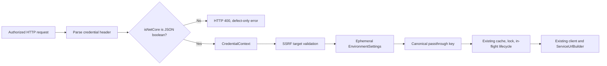

# ADR: MCP HTTP Passthrough Runtime Routing

**Status**: Accepted — facilitator checkpoint complete
**Author**: Architect Agent
**Created**: 2026-07-14
**Jira**: ENG-93348
**PRD**: [prd-mcp-http-passthrough-runtime-routing.md](../prd/prd-mcp-http-passthrough-runtime-routing.md)
**Builds on**: ENG-93208 / PR #830 (`claude/clio-mcp-multi-tenant-73a807`)
**stepsCompleted**: [1, 2, 3, 4]

---

## Context

ENG-93208 introduced per-request credential passthrough for `clio mcp-http`.
Its decoded `X-Integration-Credentials` payload identifies a target URL and
authentication material, but not the target Creatio runtime.

The omission is lost through every existing boundary:

1. `CredentialHeaderParser.CredentialPayload` has no runtime property.
2. `CredentialParseResult` and `CredentialContext` carry no runtime value.
3. `ToolCommandResolver.BuildEphemeralSettings` initializes `Uri` and auth only.
4. `EnvironmentSettings.IsNetCore` therefore retains its non-nullable `bool`
   default, `false`.
5. `ServiceUrlBuilder` interprets `false` as .NET Framework and prepends `/0/`.
6. `BuildPassthroughCacheKey` omits runtime, although the ordinary environment
   cache key already includes `settings.IsNetCore`.

The result is deterministic wrong routing for .NET Core/NET8 passthrough
tenants. A valid bearer token reaches the .NET Framework URL family instead of
the root service path.

ENG-93208 is still in Manual Testing and its gateway contract is not a released
compatibility surface. The contract can therefore be corrected before release
without supporting an ambiguous legacy default.

## Decision Summary

Add required, case-insensitive JSON property `isNetCore` to the decoded
`X-Integration-Credentials` object and carry its validated boolean through one
authoritative flow:



- `true` selects the root .NET Core/NET8 URL layout.
- `false` selects the .NET Framework `/0/` layout.
- Missing, `null`, string, numeric, or other non-boolean values return a
  secret-free HTTP 400 response.
- There is no fixed default and no runtime detection.
- The runtime discriminator becomes part of the existing canonical passthrough
  identity. No second cache/key model is introduced.
- No MCP tool argument, `ServiceUrlBuilder`, cache API, lock API, or registered
  environment contract changes.

## Detailed Decisions

### D1 — Validate the raw JSON token before producing a boolean

`CredentialPayload` will retain the raw `isNetCore` token as `JsonElement` (or
an equivalent representation that preserves JSON kind) until policy validation.

The parser distinguishes:

| Input | Result |
|---|---|
| Property omitted | `missing isNetCore` |
| `null`, string, number, array, object | `isNetCore must be a JSON boolean` |
| `true` | Valid .NET Core/NET8 selection |
| `false` | Valid .NET Framework selection |

A plain `bool` is rejected because omission would collapse to `false`. A plain
`bool?` is also insufficient for the desired defect-specific handling: invalid
string/number tokens make `System.Text.Json` throw before the contract can
classify the field. Preserving `JsonElement.ValueKind` gives deterministic,
testable error semantics without exposing the decoded payload.

The existing case-insensitive `JsonSerializerOptions` remains authoritative, so
the canonical spelling is `isNetCore` while casing variants continue to parse.

Validation order inside the decoded payload remains:

1. valid JSON object;
2. required `url`;
3. required boolean `isNetCore`;
4. usable authentication material.

Every failure remains defect-only and secret-free. The whole encoded header,
decoded JSON, token, cookie, and password never enter the error.

### D2 — Make runtime propagation compile-enforced

Add non-nullable `bool IsNetCore` to the public record contracts:

```csharp
public sealed record CredentialParseResult(
    string Url,
    CredentialMaterial Auth,
    bool IsNetCore);

public sealed record CredentialContext(
    string Url,
    CredentialMaterial Auth,
    bool IsNetCore,
    McpTransport Transport,
    bool PassthroughModeEnabled);
```

The positional constructor change is intentional: every producer and test
fixture must choose a runtime explicitly, preventing new call sites from
silently inheriting `false`. XML documentation must describe both route values.

`McpHttpServerCommand.CaptureCredentialContext` copies
`parsed.IsNetCore` only after `TryParse` succeeds. Existing middleware already
maps parse failure to HTTP 400 and returns before publishing the accessor or
calling the next delegate, so no new middleware or error envelope is needed.

An absent credential header remains valid for default/named-environment HTTP
operation. Only a credential header that is present on an authorized
passthrough request must contain `isNetCore`.

### D3 — Apply runtime before any environment-bound construction

`ToolCommandResolver.BuildEphemeralSettings` initializes the target and runtime
together:

```csharp
EnvironmentSettings settings = new() {
    Uri = context.Url,
    IsNetCore = context.IsNetCore
};
```

Authentication material is mapped afterward using the existing precedence.
The path still avoids `SettingsRepository`, `EnvironmentSettings.Fill`, and all
disk writes.

`ResolvePassthrough` keeps its existing order after header validation:

1. validate the caller-controlled URL through `ITargetUrlValidator`;
2. validate supported auth semantics;
3. build ephemeral settings;
4. derive the canonical key;
5. acquire/build the environment-bound container.

A valid runtime does not weaken SSRF protection. An invalid runtime never gets
far enough to create a target context; a valid runtime plus blocked URL still
fails before client/container construction.

### D4 — Extend the one canonical passthrough identity

Add the runtime discriminator to the secret-hashed material used by
`BuildPassthroughCacheKey`, for example:

```text
passthrough:{target-url}:{SHA-256(runtime|auth-kind|auth-material)}
```

The exact serialization must be unambiguous and culture-invariant (`1|...` /
`0|...` is sufficient). Runtime is not secret; keeping it inside the existing
hash makes the external key shape stable apart from its hash value.

No cache flush or migration is needed: the cache is in-memory and process-local.
After deployment, all new passthrough keys naturally use the corrected identity.

This is the only identity change required because the existing paths already
converge on `BuildPassthroughCacheKey`:

- `GetTenantKey` uses it before lock/in-flight reservation;
- `ResolvePassthrough` uses it for `LastResolvedTenantKey` and
  `ISessionContainerCache.Acquire`;
- `McpToolExecutionLock` forwards the same key to
  `ITenantExecutionLockProvider` and the session in-flight guard;
- `BaseTool` asserts the pre-acquire and resolved keys are equivalent.

Therefore cache reuse, same-tenant serialization, and in-flight eviction safety
stay aligned without changes to `SessionContainerCache`,
`TenantExecutionLockProvider`, or `McpToolExecutionLock`.

### D5 — Reuse existing routing and client behavior

No `ServiceUrlBuilder` change is needed. It already implements the repository
convention:

- `IsNetCore == true` → direct/root service path;
- `IsNetCore == false` → prepend `WebAppAlias` (`0/`).

The existing bearer, login/password, data-provider, and application-client
construction paths already consume `EnvironmentSettings.IsNetCore`. Once the
ephemeral settings carry the header value, all downstream consumers receive the
correct routing mode through DI.

Cookie passthrough remains unsupported in v1. Authentication precedence,
unsupported-cookie rejection, bearer-only token type, no-reauth behavior, and
mixed-input rejection are unchanged.

### D6 — Runtime detection is explicitly out of scope

Do not call or generalize `IEnvironmentRuntimeDetectionService` for this feature.
That service belongs to `reg-web-app`, probes both route families, does not treat
`AccessToken` as authenticated material, drops bearer data when cloning probe
settings, and produces registration-specific guidance.

More importantly, probing would make the gateway's target selection ambiguous,
add latency and outbound traffic, and create proxy/redirect-dependent behavior.
The gateway already chooses the tenant and must provide its deployment type.

### D7 — Update every header producer and require dual-runtime proof

Change E2E encoders to require a boolean argument with no default:

```csharp
EncodeBearerCredentials(url, token, isNetCore, authScheme = "Bearer")
EncodeLoginPasswordCredentials(url, login, password, isNetCore)
```

This compile-enforces the new contract in test/process callers.

`McpHttpPassthroughStand` will require strict boolean environment variables:

```text
CLIO_MCP_HTTP_E2E_TENANT1_IS_NET_CORE=true|false
CLIO_MCP_HTTP_E2E_TENANT2_IS_NET_CORE=true|false
```

ENG-93348 completion requires one real .NET Core/NET8 bearer tenant and one real
.NET Framework tenant. A successful tool result alone is not sufficient for URL
layout acceptance: a process-level recording/proxy fixture or equivalent
captured request evidence must assert no `/0/` for Core and exactly one `/0/`
for Framework.

### D8 — Documentation and compatibility policy

The implementation must explicitly use repository skills:

- `create-mcp-tool` for the `ToolCommandResolver` change under MCP Tools;
- `test-mcp-tool` for MCP unit and E2E coverage;
- `document-command` for `mcp-http` help and detailed documentation.

Required documentation updates:

- `clio/docs/commands/mcp-http.md`;
- `clio/help/en/mcp-http.txt`;
- `docs/McpCapabilityMap.md`.

Review `clio/Commands.md` and `clio/Wiki/WikiAnchors.txt`. Their current summary
and anchor are expected to remain accurate; if so, record
`docs reviewed, no update required` for those files.

No MCP tool argument, description, destructive classification, prompt, resource,
or guidance contract changes. The header is an HTTP host contract consumed by
the existing resolver.

ClioRing inspection found no `mcp-http`, `X-Integration-Credentials`, or
`CredentialContext` consumer under:

- `clio-ring/ClioRing.Ipc`;
- `clio-ring/ClioRing`;
- `clio-ring/ClioRing.Desktop/actions.json`.

Ring launches `mcp-server` over stdio; its `IsNetCore` data comes from registered
clio environments. The implementation summary must state:

> ClioRing compatibility reviewed, no Ring-consumed contract changed.

The Ring test/AOT gate is not triggered unless implementation expands into a
Ring-consumed contract.

## Alternatives Considered

| Alternative | Advantages | Rejection reason |
|---|---|---|
| Omitted means `.NET Framework` | Preserves current behavior | Preserves the bug and cannot distinguish omission from explicit Framework |
| Omitted means `.NET Core` | Optimizes for cloud target | Silently breaks classic tenants and hides gateway contract drift |
| Auto-detect/probe | Old payloads may continue working | Adds latency/outbound traffic and ambiguity; existing detector is not bearer-ready |
| Runtime only in ephemeral settings | Minimal code change | Wrong-runtime container may be reused because passthrough identity still collides |
| Separate runtime cache/key | Explicit separation | Duplicates identity and risks cache/lock/in-flight divergence |
| Flush cache when runtime changes | Avoids old provider reuse | Process-local key partition already solves it; global flush disrupts unrelated tenants |
| Change `ServiceUrlBuilder` | Central routing point | Builder behavior is already correct; its input is wrong |
| Introduce `runtimeType` enum now | Future extensibility | Current clio routing model is boolean; version a future multi-runtime contract when needed |

## Files and Symbols

### Production changes

| File | Change |
|---|---|
| `clio/Command/McpServer/CredentialHeaderParser.cs` | Raw-token validation, `CredentialParseResult.IsNetCore`, XML docs |
| `clio/Command/McpServer/CredentialContext.cs` | Add compile-required `IsNetCore`, XML docs |
| `clio/Command/McpServer/McpHttpServerCommand.cs` | Copy parsed runtime into request context |
| `clio/Command/McpServer/Tools/ToolCommandResolver.cs` | Apply runtime to ephemeral settings and passthrough key |

### Production files reviewed with no expected change

| File | Reason |
|---|---|
| `clio/Environment/ConfigurationOptions.cs` | Existing non-nullable settings value remains correct after validated mapping |
| `clio/Common/ServiceUrlBuilder.cs` | Already implements root versus `/0/` routing |
| `clio/Command/McpServer/SessionContainerCache.cs` | Consumes opaque canonical key |
| `clio/Command/McpServer/Tools/TenantExecutionLockProvider.cs` | Consumes the same opaque key |
| `clio/Command/McpServer/Tools/McpToolExecutionLock.cs` | Already shares key with cache/in-flight guard |
| MCP tools/prompts/resources | No argument or tool contract changes |

### Test and fixture impact

- `CredentialHeaderParserTests`: true/false/case-insensitive success; missing,
  null, string, number rejection; secret-free errors.
- `CredentialPassthroughMiddlewareTests` and
  `CredentialPassthroughAuthHardeningTests`: context propagation and HTTP 400
  short-circuit before accessor/next delegate.
- All `CredentialContext` construction sites: explicit runtime selection.
- `ToolCommandResolverTests`: ephemeral settings map both values and auth remains
  unchanged.
- `ToolCommandResolverCacheKeyTests`: same URL/auth with different runtime yields
  different secret-free keys.
- `TenantKeyEquivalenceTests`: `GetTenantKey`, acquire key, and resolved key stay
  identical for both runtime values.
- `ToolCommandResolverNoWriteTests` and
  `CredentialPassthroughSecretHygieneTests`: no persistence or leak regression.
- `clio.mcp.e2e/Support/Mcp/McpHttpServerSession.cs`: required encoder boolean.
- `clio.mcp.e2e/Support/Mcp/McpHttpPassthroughStand.cs`: strict runtime env vars.
- MCP HTTP multi-tenant/concurrency/OAuth fixtures: explicit runtime and
  dual-runtime acceptance.

## Validation Strategy

### Targeted unit gate

```shell
dotnet test clio.tests/clio.tests.csproj \
  --filter "Category=Unit&Module=McpServer"
```

This change stays inside the `McpServer` module. A full unit suite is not
required unless implementation expands to `BindingsModule.cs`, `Program.cs`,
`clio/Common/`, test infrastructure, or more than three modules.

All new/changed tests follow repository style:

- `[Category("Unit")]` / `[Property("Module", "McpServer")]`;
- `[Description("...")]` on every test;
- explicit Arrange / Act / Assert;
- every assertion includes a `because` explanation.

### HTTP/process verification

- Present header with `isNetCore: true` and verify captured route has no `/0/`.
- Present header with `isNetCore: false` and verify exactly one `/0/`.
- Present missing, `null`, string, and numeric values and verify HTTP 400, no
  downstream delegate/context, and no secret in body/logs.
- Preserve the no-header registered-environment HTTP path.

### Live MCP E2E

- Real .NET Core/NET8 tenant using bearer passthrough through `POST /mcp`.
- Real .NET Framework tenant through the same process.
- Environment-sensitive tool succeeds with no registered environment.
- Existing concurrent isolation and mixed-input rejection remain green.
- MCP E2E remains manual/not in CI and must be reported as such.

### Static checks

- `git diff --check`;
- no new `CLIO*` diagnostics in modified files;
- documentation examples encode real JSON booleans, not strings;
- search confirms no unmodified header builder omits `isNetCore`.

## Story Slicing Recommendation

1. **Header contract and fail-closed propagation** — parser/result/context,
   middleware mapping, XML docs, parser/middleware unit tests.
2. **Runtime-bound settings and canonical lifecycle identity** — resolver
   settings/key changes, client/route/cache/lock equivalence, no-write and secret
   regression tests.
3. **Dual-runtime HTTP and live E2E** — encoders, stand variables, HTTP 400
   process coverage, captured URL evidence, real Core bearer + Framework proof.
4. **Documentation and compatibility closure** — help/docs/capability map,
   Commands/Wiki review, stdio/default/named-environment no-regression, ClioRing
   compatibility statement.

Stories are ordered `1 → 2 → 3 → 4`. Every story carries its relevant tests; no
production-only story is accepted.

## Consequences

### Positive

- Correct and deterministic routing for both supported Creatio runtimes.
- Compile-enforced propagation prevents a recurrence at new context producers.
- Cache, tenant lock, and in-flight guard remain aligned through one key.
- No new probing service, DI registration, cache, lock, or persistence model.
- No regression to stdio, default HTTP, or registered environments.

### Trade-offs

- Existing passthrough header producers must add `isNetCore`; old payloads now
  receive HTTP 400. This is intentional before the umbrella feature releases.
- All tests constructing `CredentialContext` must choose a runtime explicitly.
- Completion depends on access to two real runtime families and a route-capture
  mechanism; unit success alone is insufficient.

### Security

- The runtime boolean is non-secret routing metadata.
- Credential material stays hashed in identity and redacted from every sink.
- Invalid runtime fails before the request can publish a credential context.
- Valid runtime does not bypass the existing authorization or SSRF gates.
- No request runtime or credential is persisted.

## Open Operational Prerequisite

Before implementation can be declared complete, identify:

1. a real .NET Core/NET8 tenant with a bearer token;
2. a real .NET Framework tenant;
3. a process-level route-capture method that proves root versus exactly-one-`/0/`
   behavior without exposing credentials.

No product or architectural question remains open after approval of this ADR.

## Phase 2 Checkpoint

Proceed to story writing only after confirming this design, especially:

1. raw-token validation for defect-specific HTTP 400 errors;
2. compile-required `IsNetCore` on both request records;
3. one canonical passthrough key containing runtime;
4. no runtime detection or new cache/lock APIs;
5. the four-story implementation split.
