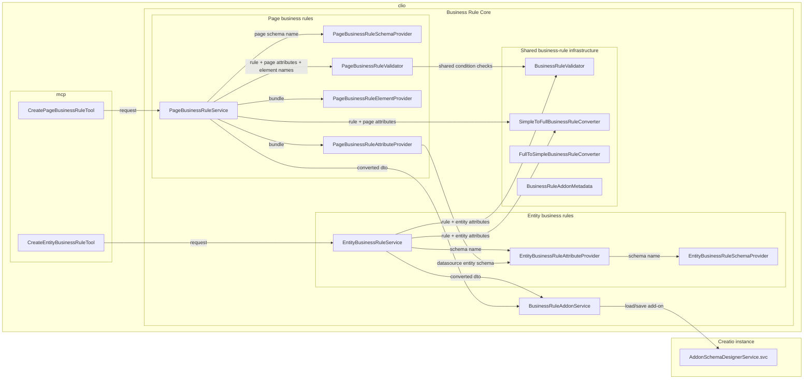

# Business Rules Architecture

## Scope

This document describes the current internal architecture for the `business-rules` feature.

## Component Diagram




## MCP Payload Example

```json
{
  "caption": "Readonly Name",
  "condition": {
    "logicalOperation": "AND",
    "conditions": [
      {
        "leftExpression": { "type": "AttributeValue", "path": "Name" },
        "comparisonType": "equal",
        "rightExpression": { "type": "Const", "value": "Readonly" }
      }
    ]
  },
  "actions": [
    {
      "type": "make-read-only",
      "items": ["Name"]
    }
  ]
}
```

## DTO Examples

### Add-on metadata DTO

```json
{
  "typeName": "Terrasoft.Core.BusinessRules.BusinessRules",
  "rules": [
    {
      "typeName": "Terrasoft.Core.BusinessRules.BusinessRule",
      "uId": "e73c78a2-e852-4d34-a4c4-f50cbe6578d6",
      "cases": [
        {
          "typeName": "Terrasoft.Core.BusinessRules.Models.BusinessRuleCase",
          "uId": "059d3c37-b741-407a-a6ff-973bd5b4e7b1",
          "condition": {
            "typeName": "Terrasoft.Core.BusinessRules.Models.Conditions.BusinessRuleGroupCondition",
            "uId": "c2729f74-5c3b-4e88-8f47-d603d0b76a56",
            "logicalOperation": 1,
            "conditions": [
              {
                "typeName": "Terrasoft.Core.BusinessRules.Models.Conditions.BusinessRuleCondition",
                "uId": "b8f788e2-3530-41cc-8a0c-6a256f179fa2",
                "leftExpression": {
                  "typeName": "Terrasoft.Core.BusinessRules.Models.Expressions.BusinessRuleAttributeExpression",
                  "uId": "e277d35c-1f25-4fce-b2db-1bf86390bfeb",
                  "type": "AttributeValue",
                  "path": "Name"
                },
                "rightExpression": {
                  "typeName": "Terrasoft.Core.BusinessRules.Models.Expressions.BusinessRuleValueExpression",
                  "uId": "81b8b8ea-36fa-447a-85d5-bf7e13649628",
                  "type": "Const",
                  "value": "Readonly"
                },
                "comparisonType": 2
              }
            ]
          },
          "actions": [
            {
              "typeName": "Terrasoft.Core.BusinessRules.Models.Actions.BusinessRuleActionReadonlyElement",
              "uId": "bee4758c-f371-497b-9624-127b5cf8f2b4",
              "enabled": false,
              "items": "Name"
            }
          ]
        }
      ],
      "triggers": [
        {
          "typeName": "Terrasoft.Core.BusinessRules.Models.Trigger",
          "uId": "c334b501-8df3-4763-84bd-9ce115aaa919",
          "name": "Name"
        }
      ],
      "name": "BusinessRule_1c48625",
      "enabled": false
    }
  ]
}
```

### Add-on schema DTO

```json
{
  "name": "UsrContactBusinessRule",
  "parentSchemaUId": "3a2d6f51-1bfc-4c17-aacb-b53de4866b7c",
  "uId": "f520f0a2-c7be-4665-8248-47fbd3261f55",
  "body": null,
  "dependencies": null,
  "forceSave": false,
  "id": "242a8ec4-199c-4472-bbf3-aa8feeb59710",
  "isFullHierarchyDesignSchema": false,
  "isReadOnly": false,
  "package": {
    "createdBy": null,
    "createdOn": null,
    "description": null,
    "hotfixState": 0,
    "id": "00000000-0000-0000-0000-000000000000",
    "installBehavior": 0,
    "installType": 0,
    "maintainer": null,
    "modifiedBy": null,
    "modifiedOn": null,
    "name": "DevPkg",
    "position": 0,
    "type": 1,
    "uId": "76d29528-034b-cd65-b7ad-6ffdc9b5dacc"
  },
  "useFullHierarchy": true,
  "userLevelSchema": false,
  "addonTypes": [],
  "caption": [
    {
      "cultureName": "ru-RU",
      "value": "Contact (Business rules)"
    },
    {
      "cultureName": "en-US",
      "value": "Contact (Business rules)"
    }
  ],
  "description": [],
  "localizableStrings": [],
  "optionalProperties": [],
  "addonName": "BusinessRule",
  "extendParent": false,
  "metaData": "<Addon metadata DTO>",
  "resources": [
    {
      "key": "e73c78a2-e852-4d34-a4c4-f50cbe6578d6.Caption",
      "value": [
        {
          "key": "en-US",
          "value": "Readonly Name"
        }
      ]
    }
  ],
  "targetSchemaManagerName": "EntitySchemaManager",
  "targetSchemaUId": "16be3651-8fe2-4159-8dd0-a803d4683dd3"
}
```

## Read / Update / Delete Flow

The read/update/delete MCP tools (see
[business-rules-spec.md](./business-rules-spec.md)) reuse the same service and
add-on pipeline:

- `BusinessRuleAddonService.ReadRules` fetches the add-on schema and
  `FullToSimpleBusinessRuleConverter` maps persisted metadata back to the friendly contract
  (the reverse of `SimpleToFullBusinessRuleConverter`), folding autogenerated apply-filter
  child rules into the parent action; a rule the contract cannot represent fails the
  read with an error naming the rule. For apply-static-filter actions the reader calls
  `FullToSimpleFilterConverter` (the inverse of `SimpleToFullFilterConverter`) to decompile the
  persisted ESQ envelope back into the friendly `filter` object.
- Update runs in the service (`EntityBusinessRuleService.Update` /
  `PageBusinessRuleService.Update`): it fetches the add-on schema once
  (`BusinessRuleAddonService.GetSchema`), matches each rule by name, and passes the matched
  existing rule node into `SimpleToFullBusinessRuleConverter`, which builds the replacement
  metadata already carrying the existing rule/case/condition-group/trigger uIds (and
  apply-filter child rules anchored to the existing rule uId) — so identity is stamped
  during construction, not patched afterward, and the platform stores a short diff.
  Caller-supplied block uIds are honored by the converter. The per-item match/replace/save
  loop is shared across entity and page by `BusinessRuleAddonMetadata.ApplyUpdateBatch`, and
  the batch persists once via `BusinessRuleAddonService.SaveSchema`.
- `BusinessRuleAddonService.DeleteRules` removes rules by name, cascading to
  autogenerated child rules and caption resources.
- Each batch persists with a single `SaveSchema` + client-cache reset + configuration
  rebuild, mirroring the create batch behavior.

## Key Design Decisions

- Persist business rules through `AddonSchemaDesignerService.svc`, not runtime business-rule endpoints.
- Route MCP execution straight to `EntityBusinessRuleService` / `PageBusinessRuleService` via `BusinessRuleToolExecutor`, which resolves the environment-specific service per request; there is no intermediate command wrapper.
- Keep request-level preconditions in `EntityBusinessRuleService`, while `BusinessRuleValidator` owns complete rule validation including schema-aware checks.
- Keep `SimpleToFullBusinessRuleConverter` isolated so MCP request DTOs do not become the persistence model.
- Start with `CreateEntityBusinessRuleTool`, but keep the service structure extensible for additional tools later.
- Treat `IEntityBusinessRuleService` and `EntityBusinessRuleCreateRequest` as the intentional entity-specific service API after the page-rule split. The old generic `IBusinessRuleService` / `BusinessRuleCreateRequest` names are not preserved because the supported compatibility boundary is the CLI/MCP contract, not internal command-service abstractions.

## Related Docs

- Product spec: [business-rules-spec.md](./business-rules-spec.md)
