# Console UI Environment Manager - Technical Architecture

## System Architecture

### Component Overview

```
┌─────────────────────────────────────────────────────────────┐
│                     User Interface Layer                     │
│  ┌────────────────────────────────────────────────────────┐ │
│  │         EnvManageUiCommand (Main Entry Point)          │ │
│  └────────────────────────────────────────────────────────┘ │
│                           │                                  │
│                           ▼                                  │
│  ┌────────────────────────────────────────────────────────┐ │
│  │            Spectre.Console UI Components               │ │
│  │  - SelectionPrompt  - TextPrompt  - Panels  - Tables  │ │
│  └────────────────────────────────────────────────────────┘ │
└─────────────────────────────────────────────────────────────┘
                           │
                           ▼
┌─────────────────────────────────────────────────────────────┐
│                    Business Logic Layer                      │
│  ┌────────────────────────────────────────────────────────┐ │
│  │              EnvManageUiService                        │ │
│  │  - Validation  - Formatting  - Business Rules          │ │
│  └────────────────────────────────────────────────────────┘ │
└─────────────────────────────────────────────────────────────┘
                           │
                           ▼
┌─────────────────────────────────────────────────────────────┐
│                     Data Access Layer                        │
│  ┌────────────────────────────────────────────────────────┐ │
│  │            ISettingsRepository (Interface)             │ │
│  │  - GetAllEnvironments  - ConfigureEnvironment          │ │
│  │  - RemoveEnvironment   - SetActiveEnvironment          │ │
│  └────────────────────────────────────────────────────────┘ │
│                           │                                  │
│  ┌────────────────────────────────────────────────────────┐ │
│  │            SettingsRepository (Implementation)         │ │
│  └────────────────────────────────────────────────────────┘ │
└─────────────────────────────────────────────────────────────┘
                           │
                           ▼
┌─────────────────────────────────────────────────────────────┐
│                      Persistence Layer                       │
│  ┌────────────────────────────────────────────────────────┐ │
│  │               appsettings.json File                    │ │
│  └────────────────────────────────────────────────────────┘ │
└─────────────────────────────────────────────────────────────┘
```

## Class Diagram


## Sequence Diagrams

### Create Environment Flow (Table-Based Interactive UI)

```mermaid
sequenceDiagram
    participant User
    participant Command
    participant Service
    participant Repository
    participant FileSystem
    
    User->>Command: Select "Create Environment"
    Command->>Command: Initialize empty name, default settings
    
    loop Interactive Editing
        Command->>User: Show table with 11 fields (0-10) + Save/Cancel
        User->>Command: Select field to edit (e.g., "0. Name")
        
        alt Text Field
            Command->>User: Prompt for value (TextPrompt)
            User->>Command: Enter value
        else Boolean Field
            Command->>User: Confirm prompt (Y/n)
            User->>Command: Enter boolean
        end
        
        Command->>Command: Update field in memory
        Command->>User: Return to updated table
    end
    
    User->>Command: Select "💾 Save & Create"
    
    Command->>Service: ValidateEnvironmentName(name)
    Service->>Repository: IsEnvironmentExists(name)
    Repository-->>Service: false
    Service-->>Command: ValidationResult.Success
    
    Command->>Service: ValidateUrl(url)
    Service-->>Command: ValidationResult.Success
    
    Command->>Command: Validate Login non-empty
    
    alt All Validations Pass
        Command->>Repository: ConfigureEnvironment(name, settings)
        Repository->>FileSystem: Write to appsettings.json
        FileSystem-->>Repository: Success
        Repository-->>Command: Success
        Command->>User: Display success message
    else Validation Fails
        Command->>User: Display error, return to table
    end
```



### Edit Environment with Rename Flow

```mermaid
sequenceDiagram
    participant User
    participant Command
    participant Service
    participant Repository
    participant FileSystem
    
    User->>Command: Select "Edit Environment"
    Command->>Repository: GetAllEnvironments()
    Repository-->>Command: Dictionary<string, EnvironmentSettings>
    
    Command->>User: Show environment list
    User->>Command: Select "old-name"
    
    Command->>Repository: FindEnvironment("old-name")
    Repository-->>Command: EnvironmentSettings
    
    Command->>Command: Initialize editedName = "old-name"
    
    loop Interactive Editing
        Command->>User: Show table with 11 fields (0-10) including Name + Save/Cancel
        User->>Command: Select field (e.g., "0. Name")
        
        alt Name Field
            Command->>User: Prompt for new name (TextPrompt)
            User->>Command: Enter "new-name"
            
            alt Name Changed
                Command->>Service: ValidateEnvironmentName("new-name")
                Service->>Repository: IsEnvironmentExists("new-name")
                Repository-->>Service: false (excluding current)
                Service-->>Command: ValidationResult.Success
                Command->>Command: Set editedName = "new-name"
            else Name Validation Fails
                Command->>User: Show error, keep old name
            end
        else Other Field
            Command->>User: Prompt for value
            User->>Command: Enter value
            Command->>Command: Update field in memory
        end
        
        Command->>User: Return to updated table
    end
    
    User->>Command: Select "💾 Save Changes"
    
    alt Name Changed (Rename Operation)
        Command->>Repository: GetDefaultEnvironmentName()
        Repository-->>Command: Check if "old-name" is active
        
        Command->>Repository: RemoveEnvironment("old-name")
        Repository->>FileSystem: Delete old environment
        
        Command->>Repository: ConfigureEnvironment("new-name", editedSettings)
        Repository->>FileSystem: Write new environment
        
        alt Was Active
            Command->>Repository: SetActiveEnvironment("new-name")
            Repository->>FileSystem: Update ActiveEnvironmentKey
        end
        
        Command->>User: "Environment renamed from 'old-name' to 'new-name' and updated successfully!"
    else Name Unchanged (Regular Update)
        Command->>Repository: ConfigureEnvironment("old-name", editedSettings)
        Repository->>FileSystem: Update environment
        Command->>User: "Environment 'old-name' updated successfully!"
    end
```



### Delete Environment Flow


## Data Flow

### Configuration Read Flow

```
User Request
    ↓
EnvManageUiCommand
    ↓
ISettingsRepository.GetAllEnvironments()
    ↓
SettingsRepository reads _settings field (cached)
    ↓
Return Dictionary<string, EnvironmentSettings>
    ↓
Format for display using Spectre.Console
    ↓
Display to User
```

### Configuration Write Flow

```
User Input
    ↓
EnvManageUiCommand validates input
    ↓
IEnvManageUiService.Validate*()
    ↓
If valid:
    EnvManageUiCommand.ConfigureEnvironment()
        ↓
    ISettingsRepository.ConfigureEnvironment()
        ↓
    Update _settings field
        ↓
    Save() - Write to appsettings.json
        ↓
    Success
Else:
    Show error, retry
```

## Key Design Patterns

### 1. Command Pattern

**Purpose**: Encapsulate environment operations as commands

**Implementation**:
- Each menu option maps to a method
- Methods return status codes (0 = success, 1 = error)
- Consistent interface across all operations

### 2. Repository Pattern

**Purpose**: Abstract data access from business logic

**Benefits**:
- Testable (can mock ISettingsRepository)
- Separation of concerns
- Can swap implementations without changing command logic

### 3. Service Layer Pattern

**Purpose**: Centralize business logic and validation

**Implementation**:
```csharp
public interface IEnvManageUiService
{
    ValidationResult ValidateEnvironmentName(string name);
    ValidationResult ValidateUrl(string url);
    string MaskSensitiveData(string fieldName, string value);
    // ... other business logic methods
}
```

**Benefits**:
- Reusable validation logic
- Testable in isolation
- Single responsibility

### 4. Dependency Injection

**Purpose**: Loose coupling and testability

**Implementation**:
```csharp
public class EnvManageUiCommand : Command<EnvManageUiOptions>
{
    private readonly ISettingsRepository _settingsRepository;
    private readonly ILogger _logger;
    private readonly IEnvManageUiService _service;
    
    public EnvManageUiCommand(
        ISettingsRepository settingsRepository,
        ILogger logger,
        IEnvManageUiService service)
    {
        _settingsRepository = settingsRepository;
        _logger = logger;
        _service = service;
    }
}
```

**Registration** in BindingsModule:
```csharp
Bind<IEnvManageUiCommand>().To<EnvManageUiCommand>();
Bind<IEnvManageUiService>().To<EnvManageUiService>();
```

### 5. Interactive Table-Based Editing Pattern

**Purpose**: Unified, intuitive UX for Create and Edit operations

**Implementation**:
```csharp
// Both CreateEnvironment and EditEnvironment use this pattern
private int EditWithInteractiveTable(string name, EnvironmentSettings env)
{
    var editedName = name;  // Track name changes separately
    var keepEditing = true;
    
    while (keepEditing)
    {
        // 1. Display current values in table
        var table = new Table();
        table.AddColumn("Field");  // Left-aligned, no .Centered()
        table.AddColumn("Value");
        
        // Add all 11 fields including Name as field 0
        table.AddRow("0. Name", editedName ?? "");
        table.AddRow("1. URL", env.Uri ?? "");
        // ... fields 2-10
        
        AnsiConsole.Write(table);
        
        // 2. Prompt for field selection with visible Save/Cancel
        var choices = new List<string>
        {
            "0. Name", "1. URL", "2. Login", "3. Password",
            "4. Maintainer", "5. IsNetCore", "6. ClientId",
            "7. ClientSecret", "8. AuthAppUri", "9. Safe Mode",
            "10. Developer Mode",
            "──────────────────",  // Visual separator
            "💾 Save Changes",
            "❌ Cancel"
        };
        
        var choice = AnsiConsole.Prompt(
            new SelectionPrompt<string>()
                .Title("Select a field to edit:")
                .PageSize(15)  // Ensures Save/Cancel visible
                .AddChoices(choices));
        
        // 3. Handle field editing or actions
        if (choice.StartsWith("0."))
        {
            // Edit name with validation
            var newName = AnsiConsole.Prompt(...);
            if (newName != name)  // Name changed
            {
                var validation = _service.ValidateEnvironmentName(newName, _settingsRepository);
                if (validation.Successful)
                    editedName = newName;
                else
                    ShowError(validation.ErrorMessage);
            }
        }
        else if (choice.StartsWith("1."))
        {
            // Edit URL
            env.Uri = AnsiConsole.Prompt(...);
        }
        // ... handle other fields
        else if (choice.Contains("💾"))
        {
            // Validate and save
            // Handle rename if name changed
            keepEditing = false;
        }
        else if (choice.Contains("❌"))
        {
            return 0;  // Cancel
        }
    }
}
```

**Key Features**:
- All fields visible in table simultaneously
- Name is field 0, editable like any other field
- SelectionPrompt with `.PageSize(15)` ensures buttons visible
- Separator line between fields and actions
- Return to updated table after each field edit
- Validation on save, not during input
- Field column left-aligned (no `.Centered()`)

**Rename Operation Logic**:
```csharp
// In EditEnvironment's save handler
if (editedName != envName)  // Name changed - rename operation
{
    var isActive = _settingsRepository.GetDefaultEnvironmentName() == envName;
    
    // Delete old environment
    _settingsRepository.RemoveEnvironment(envName);
    
    // Create with new name
    _settingsRepository.ConfigureEnvironment(editedName, editedEnv);
    
    // Preserve active status
    if (isActive)
        _settingsRepository.SetActiveEnvironment(editedName);
    
    AnsiConsole.MarkupLine($"Environment renamed from '{envName}' to '{editedName}' and updated successfully!");
}
else
{
    // Regular update without rename
    _settingsRepository.ConfigureEnvironment(envName, editedEnv);
    AnsiConsole.MarkupLine($"Environment '{envName}' updated successfully!");
}
```

## Data Models

### EnvironmentSettings (Existing)

```csharp
public class EnvironmentSettings
{
    // Connection
    public string Uri { get; set; }
    public string Login { get; set; }
    public string Password { get; set; }
    
    // Platform
    public bool IsNetCore { get; set; }
    
    // Authentication
    public string ClientId { get; set; }
    public string ClientSecret { get; set; }
    public string AuthAppUri { get; set; }
    public string SimpleloginUri { get; set; }
    
    // Metadata
    public string Maintainer { get; set; }
    
    // Configuration
    public bool Safe { get; set; }
    public bool DeveloperModeEnabled { get; set; }
    public bool IsDevMode { get; set; }
    public string WorkspacePathes { get; set; }
    public string EnvironmentPath { get; set; }
    
    // Database
    public string DbName { get; set; }
    public string BackupFilePath { get; set; }
    public string DbServerKey { get; set; }
    public DbServerConfiguration DbServer { get; set; }
}
```

### MenuChoice (New)

```csharp
internal enum MenuChoice
{
    ListEnvironments,
    ViewDetails,
    Create,
    Edit,
    Delete,
    SetActive,
    Exit
}
```

### Field Definitions (For Create/Edit Tables)

```csharp
// Field identifiers for interactive table editing
internal static class FieldNames
{
    public const string Name = "0. Name";
    public const string URL = "1. URL";
    public const string Login = "2. Login";
    public const string Password = "3. Password";
    public const string Maintainer = "4. Maintainer";
    public const string IsNetCore = "5. IsNetCore";
    public const string ClientId = "6. ClientId";
    public const string ClientSecret = "7. ClientSecret";
    public const string AuthAppUri = "8. AuthAppUri";
    public const string SafeMode = "9. Safe Mode";
    public const string DeveloperMode = "10. Developer Mode";
}
```

### Rename Operation Data

```csharp
// Data tracked during rename operation
internal class RenameContext
{
    public string OriginalName { get; set; }
    public string NewName { get; set; }
    public bool WasActive { get; set; }
    public EnvironmentSettings Settings { get; set; }
    
    public bool IsRename => OriginalName != NewName;
}
```

### ValidationResult (Spectre.Console)

```csharp
// Built-in Spectre.Console class
public class ValidationResult
{
    public bool IsValid { get; }
    public string ErrorMessage { get; }
    
    public static ValidationResult Success();
    public static ValidationResult Error(string message);
}
```

## Error Handling Strategy

### Levels of Error Handling

1. **Validation Level** (Proactive)
   - Input validation with immediate feedback
   - Prevents invalid data from entering system
   - Uses Spectre.Console validation features

2. **Business Logic Level**
   - Try-catch in service methods
   - Return meaningful error messages
   - Log errors appropriately

3. **Command Level**
   - Catch all exceptions
   - Display user-friendly messages
   - Return error codes (1 for error)

4. **Repository Level**
   - Handle file I/O errors
   - Throw specific exceptions
   - Preserve data integrity

### Error Handling Example

```csharp
public override int Execute(EnvManageUiOptions options)
{
    try
    {
        // Main logic
        while (true)
        {
            var choice = ShowMainMenu();
            
            try
            {
                var result = ExecuteChoice(choice);
                if (choice == MenuChoice.Exit)
                    return result;
            }
            catch (KeyNotFoundException ex)
            {
                _logger.WriteError($"Environment not found: {ex.Message}");
                // Continue to next iteration
            }
            catch (IOException ex)
            {
                _logger.WriteError($"File error: {ex.Message}");
                // Continue to next iteration
            }
            
            Console.WriteLine("\nPress any key to continue...");
            Console.ReadKey(true);
            Console.Clear();
        }
    }
    catch (Exception ex)
    {
        // Catch-all for unexpected errors
        _logger.WriteError($"Unexpected error: {ex.Message}");
        return 1;
    }
}
```

## Security Considerations

### Sensitive Data Handling

1. **Display Masking**
```csharp
private string MaskSensitiveData(string fieldName, string value)
{
    if (string.IsNullOrEmpty(value))
        return "[dim]not set[/]";
    
    var sensitiveFields = new[] { "Password", "ClientSecret", "DBPassword" };
    
    if (sensitiveFields.Contains(fieldName, StringComparer.OrdinalIgnoreCase))
        return "[red]****[/]";
    
    return value;
}
```

2. **Input Masking**
```csharp
var password = AnsiConsole.Prompt(
    new TextPrompt<string>("[green]Password:[/]")
        .Secret()  // Masks input with *
        .AllowEmpty()
);
```

3. **Logging**
```csharp
// NEVER log sensitive data
_logger.WriteInfo($"Created environment: {name}");  // OK
_logger.WriteInfo($"Password: {password}");          // NEVER DO THIS
```

### File Permissions

- Respect existing appsettings.json permissions
- Don't change file permissions
- Fail gracefully if write permission denied

### Validation Security

- Prevent path traversal in workspace paths
- Validate URL schemes (only http/https)
- Sanitize inputs before saving

## Performance Considerations

### Caching

```csharp
// SettingsRepository already caches configuration
private Settings _settings;  // Loaded once at startup

public Dictionary<string, EnvironmentSettings> GetAllEnvironments()
{
    return _settings.Environments;  // Return cached data
}
```

### Lazy Loading

- Don't load environment details until requested
- Only read file once per session
- Write to file only when changes made

### Memory Management

- Dispose of resources properly
- No memory leaks in loop
- Handle large environment lists efficiently

## Testing Strategy

### Unit Testing

**Mock Dependencies**:
```csharp
[Test]
public void CreateEnvironment_ValidInput_Success()
{
    // Arrange
    var mockRepo = Substitute.For<ISettingsRepository>();
    var mockLogger = Substitute.For<ILogger>();
    var mockService = Substitute.For<IEnvManageUiService>();
    
    mockRepo.IsEnvironmentExists("test").Returns(false);
    mockService.ValidateEnvironmentName("test")
        .Returns(ValidationResult.Success());
    
    var command = new EnvManageUiCommand(mockRepo, mockLogger, mockService);
    
    // Act
    // ... test logic
    
    // Assert
    mockRepo.Received(1).ConfigureEnvironment("test", Arg.Any<EnvironmentSettings>());
}
```

### Integration Testing

**Test with Real Repository**:
```csharp
[Test]
public void EndToEnd_CreateEditDelete_Success()
{
    // Arrange - Use test config file
    var fileSystem = new MockFileSystem();
    var repo = new SettingsRepository(fileSystem);
    var command = new EnvManageUiCommand(repo, logger, service);
    
    // Act - Create, Edit, Delete
    // Assert - Verify file changes
}
```

### UI Testing

Manual testing required for:
- Keyboard navigation
- Visual layout
- Cross-platform rendering
- Color support in different terminals

## Deployment Considerations

### Package Dependencies

Add to clio.csproj:
```xml
<PackageReference Include="Spectre.Console" Version="0.49.1" />
```

### Backward Compatibility

- No changes to existing commands
- No changes to appsettings.json schema
- Uses existing ISettingsRepository interface

### Platform Support

- Windows: PowerShell, CMD
- macOS: Terminal, iTerm2
- Linux: bash, zsh, fish

### Terminal Requirements

- Minimum: ANSI color support
- Recommended: Unicode support for box drawing
- Fallback: ASCII-only mode if needed

## Future Extensibility

### Planned Enhancements

1. **Search/Filter**
```csharp
private int SearchEnvironments()
{
    var query = AnsiConsole.Ask<string>("Search:");
    var filtered = environments.Where(e => e.Key.Contains(query));
    // Display filtered list
}
```

2. **Import/Export**
```csharp
private int ExportEnvironment()
{
    // Export to JSON file
}

private int ImportEnvironment()
{
    // Import from JSON file
}
```

3. **Environment Templates**
```csharp
private int CreateFromTemplate()
{
    // Select template, create environment
}
```

### Extension Points

- Add new menu options easily
- Extend validation rules
- Add new display formats
- Plugin architecture for custom operations

## References

- [Spectre.Console Documentation](https://spectreconsole.net/)
- [Dependency Injection in .NET](https://docs.microsoft.com/en-us/dotnet/core/extensions/dependency-injection)
- [Repository Pattern](https://martinfowler.com/eaaCatalog/repository.html)
- [Command Pattern](https://refactoring.guru/design-patterns/command)

## Glossary

- **ANSI**: American National Standards Institute - terminal control codes
- **DI**: Dependency Injection
- **CRUD**: Create, Read, Update, Delete
- **Repository**: Design pattern for data access abstraction
- **Validation**: Process of checking input correctness
