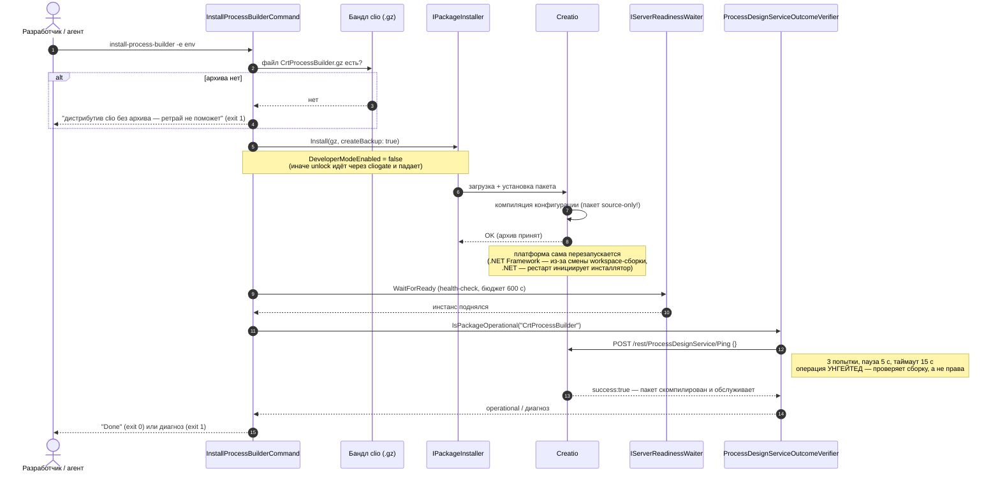
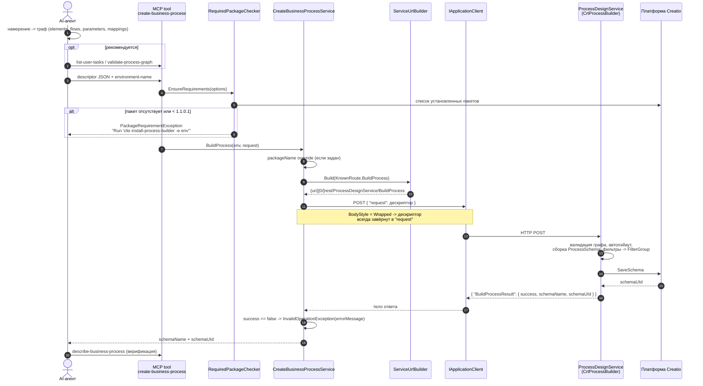
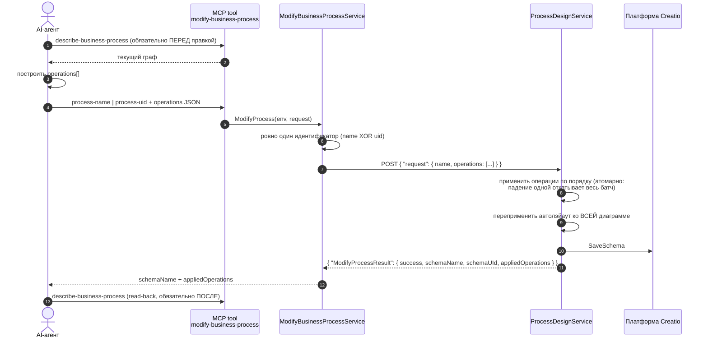

# Kick-off: как clio работает в связке с пакетом CrtProcessBuilder

Материалы для kick-off. Всё ниже сверено с кодом на ветке `feature/ENG-94385-bundle-process-builder-package`.

---

## 1. Суть связки в трёх предложениях

1. **clio** — клиент (CLI + MCP-сервер). Он **не** умеет собирать метаданные процесса и **не** ходит в БД Creatio напрямую: он транслирует намерение в декларативный JSON и отправляет его одним HTTP POST.
2. **CrtProcessBuilder** — Creatio-пакет, который ставится **на стенд** и поднимает там REST-сервис `ProcessDesignService`. Именно он владеет сериализацией метаданных (элементы, фильтры, маппинги, автолэйаут) и сохранением схемы.
3. Пакет **физически лежит внутри дистрибутива clio** (`clio/CrtProcessBuilder/CrtProcessBuilder.gz`) и ставится командой `clio install-process-builder -e <env>`. Ничего не скачивается из интернета, но пакет — **source-only**: сборку делает сам целевой стенд.

> Ключевое следствие для kick-off: «пакет установлен» и «пакет работает» — **два разных состояния**. Ни одно чтение БД их не различает, поэтому установка отдельно проверяет, что сервис отвечает.

---

## 2. Компонентная диаграмма (что где живёт)

```mermaid
flowchart LR
    subgraph AI["AI-агент / разработчик"]
        A1["Claude / IDE agent"]
        A2["Терминал"]
    end

    subgraph CLIO["clio (клиентская сторона)"]
        direction TB
        MCP["MCP-сервер<br/>create/modify/describe/list-user-tasks<br/>FeatureToggle: process-designer<br/>(lazy surface, не в tools/list)"]
        VERB["CLI verb<br/>install-process-builder"]
        GATE["RequiredPackageChecker<br/>[RequiresPackage CrtProcessBuilder 1.1.0.1]"]
        CMD["Command-слой<br/>CreateBusinessProcessService<br/>ModifyBusinessProcessService<br/>ServerProcessDescriber"]
        URL["ServiceUrlBuilder<br/>KnownRoute -> /rest/ProcessDesignService/*<br/>(+ префикс 0/ для .NET Framework)"]
        HTTP["IApplicationClient<br/>(auth, retry, timeout)"]
        GZ[("Бандл в дистрибутиве<br/>CrtProcessBuilder.gz")]
    end

    subgraph CRT["Creatio (целевой стенд)"]
        direction TB
        SVC["ProcessDesignService<br/>BuildProcess / ModifyProcess /<br/>DescribeProcess / ListUserTasks /<br/>Ping"]
        CORE["Платформа: ProcessSchemaManager,<br/>EntitySchemaManager, FilterGroup,<br/>валидация процесса"]
        DB[("SysSchema / SysPackage")]
        UI["Process Designer (UI)"]
    end

    A1 --> MCP
    A2 --> VERB
    MCP --> GATE --> CMD
    VERB --> GZ
    CMD --> URL --> HTTP
    HTTP -->|"HTTP POST JSON"| SVC
    VERB -->|"push-pkg + компиляция<br/>на стороне стенда"| CRT
    SVC --> CORE --> DB
    DB --> UI

    classDef clio fill:#e8f0fe,stroke:#4478d0
    classDef crt fill:#eaf7ee,stroke:#3f9c5a
    class MCP,VERB,GATE,CMD,URL,HTTP,GZ clio
    class SVC,CORE,DB,UI crt
```



**Границы ответственности**

| Слой | Отвечает за | НЕ отвечает за |
|---|---|---|
| AI-агент | перевод «хочу процесс X» → граф (элементы, потоки, параметры) | формат метаданных Creatio |
| clio | транспорт, аутентификация, гейт версии пакета, маршрут, разбор конверта ответа | семантику BPMN, сериализацию схемы |
| CrtProcessBuilder | сериализация в `ProcessSchema`, автолэйаут, фильтры → `Terrasoft.FilterGroup`, валидация, сохранение | выбор архитектуры процесса |

Важно: **clio не делает ни одного LLM-вызова**. Интеллект — на стороне агента, детерминированная сборка — на стороне пакета.

---

## 3. Sequence: установка пакета (`clio install-process-builder -e <env>`)

Единственный verb этой связки, доступный из CLI. Все остальные операции — только через MCP.



Три вещи, которые стоит проговорить на kick-off:

- **Нет короткого замыкания**: явный запрос установки всегда ставит пакет (цена лишнего прогона — одна пересборка конфигурации).
- **Проверяется исход, а не вызов**: `SysPackage` запишет принятую версию даже если компиляция не удалась. Ответ `Ping` — единственное доказательство, что пакет вообще скомпилирован. Это проверка живости, не тождества: на АПГРЕЙДЕ устаревшая сборка тоже ответит и проверку пройдёт (осознанный предел, см. ADR).
- **Бамп версии — только через `clio set-pkg-version`**: он пишет и `PackageVersion`, и `ModifiedOnUtc`. Без сдвига `ModifiedOnUtc` платформа вообще не перезапишет строку `SysPackage` — версия молча останется старой.

---

## 4. Sequence: создание процесса (`create-business-process`)



---

## 5. Sequence: модификация процесса (`modify-business-process`)

Отличие от создания принципиальное: **это упорядоченный список операций над существующей схемой**, и структурной валидации на этом пути **нет**.



Риски, которые надо назвать вслух:

- `removeElement` **каскадит** (удаляет связанные потоки и маппинги), но **не сшивает** разрыв — мостовой `addFlow` нужно слать в том же батче.
- Любой modify **переприменяет автолэйаут ко всей диаграмме** — вручную разложенная многодорожечная схема схлопнется в сгенерированные ряды слева направо.
- Конструкции, которые билдер не умеет создавать (шлюзы, условные потоки, таймеры), при сохранении **переживают** правку как данные — но удалить или перевязать их по имени можно, и никто не предупредит.

---

## 6. Контракт: маршруты, verbs, гейты

| Операция | MCP tool | CLI verb | Маршрут (`ServiceUrlBuilder.KnownRoute`) | Гейт |
|---|---|---|---|---|
| Установка пакета | `install-process-builder` | `install-process-builder` | (push-pkg, не REST) | нет (иначе сам себя заблокирует) |
| Проверка сборки | — (внутренняя) | — | `/rest/ProcessDesignService/Ping` | нет (ungated by design) |
| Палитра задач | `list-user-tasks` | — | `/rest/ProcessDesignService/ListUserTasks` | `RequiresPackage` + `FeatureToggle` |
| Создание | `create-business-process` | — | `/rest/ProcessDesignService/BuildProcess` | `RequiresPackage` + `FeatureToggle` |
| Правка | `modify-business-process` | — | `/rest/ProcessDesignService/ModifyProcess` | `RequiresPackage` + `FeatureToggle` |
| Чтение | `describe-business-process` | — | `/rest/ProcessDesignService/DescribeProcess` | `RequiresPackage` + `FeatureToggle` |
| Пре-чек графа | `validate-process-graph` | — | локально (R1–R17) | `RequiresPackage` + `FeatureToggle` |

Детали, которые обычно спрашивают:

- Для .NET Framework `ServiceUrlBuilder` сам добавляет префикс `0/`: `{uri}/0/rest/ProcessDesignService/BuildProcess`.
- Все четыре операции — WCF с `BodyStyle=Wrapped`: тело запроса **всегда** `{"request": {...}}`, ответ — `{"<Method>Result": {...}}`.
- MCP-инструменты закрыты фичетоглом `process-designer` и живут на «ленивой» поверхности: их нет в `tools/list`, они находятся через `get-tool-contract`.
- Минимальная версия пакета зашита в `BundledPackages.ProcessBuilderVersion` (сейчас `1.1.0.1`) и должна быть **четырёхсоставной** — иначе сравнение через `System.Version` даст `Revision = -1`.

---

## 7. JSON: создание процесса

### 7.1 Что отдаёт агент (`descriptor`)

Минимальный процесс «старт → задача → конец»:

```json
{
  "name": "UsrClioBpDemo1",
  "caption": "Demo: перевод заявки в работу",
  "packageName": "Custom",
  "elements": [
    { "name": "StartEvent1", "type": "startEvent" },
    { "name": "task1", "type": "performTask", "caption": "Обработать заявку" },
    { "name": "EndEvent1", "type": "endEvent" }
  ],
  "flows": [
    { "source": "StartEvent1", "target": "task1" },
    { "source": "task1", "target": "EndEvent1" }
  ]
}
```

Боевой вариант — запуск по событию записи, с фильтром, параметрами и маппингом:

```json
{
  "name": "UsrClioBpOnSave1",
  "caption": "Запуск при изменении контакта",
  "packageName": "Custom",
  "elements": [
    {
      "name": "SignalStart1",
      "type": "signalStart",
      "signal": { "entity": "Contact", "on": "modified", "changedColumns": ["Name"] },
      "filter": {
        "object": "Contact",
        "logicalOperation": "and",
        "conditions": [
          { "column": "Name", "comparison": "contains", "value": "Creatio" },
          { "column": "CreatedOn", "comparison": "greaterOrEqual", "macro": "PreviousNDays", "macroArgument": 7 }
        ]
      }
    },
    { "name": "task1", "type": "performTask", "caption": "Проверить контакт", "useBackgroundMode": false },
    { "name": "EndEvent1", "type": "endEvent" }
  ],
  "flows": [
    { "source": "SignalStart1", "target": "task1" },
    { "source": "task1", "target": "EndEvent1" }
  ],
  "parameters": [
    { "name": "MyText", "type": "Text", "direction": "In", "caption": "Комментарий" },
    { "name": "City", "referenceSchema": "City", "direction": "In" }
  ],
  "mappings": [
    { "elementName": "task1", "elementParameter": "Recommendation", "processParameter": "MyText" }
  ]
}
```

Что здесь важно проговорить:

- `name` элемента — это **локальный хэндл** (schema element `Name`), на него ссылаются `flows.source/target` и `mappings.elementName`. GUID платформа держит в `Id`/`UId` сама.
- Позиции элементов **не задаются** — лэйаут строит сервер (start слева, end справа, без пересечений).
- Фильтр описывается **высокоуровнево**; экранированный `Terrasoft.FilterGroup` собирает сервер. Руками фильтр никто не пишет.
- На `signalStart` правая часть условия — только константа / макрос / `datePart`: сигнал вычисляется до того, как экземпляр процесса существует.

### 7.2 Что реально уходит по проводу

`CreateBusinessProcessService` заворачивает дескриптор в `request` (BodyStyle=Wrapped):

```http
POST {uri}/0/rest/ProcessDesignService/BuildProcess
Content-Type: application/json
```

```json
{
  "request": {
    "name": "UsrClioBpDemo1",
    "caption": "Demo: перевод заявки в работу",
    "packageName": "Custom",
    "elements": [ "..." ],
    "flows": [ "..." ]
  }
}
```

### 7.3 Ответ

```json
{
  "BuildProcessResult": {
    "success": true,
    "schemaName": "UsrClioBpDemo1",
    "schemaUId": "5c58c4c4-134b-4744-9c67-96d9c69c9d55",
    "errorMessage": null
  }
}
```

Ошибка приходит тем же конвертом с HTTP 200 — clio разбирает `success` и поднимает исключение с `errorMessage`:

```json
{
  "BuildProcessResult": {
    "success": false,
    "errorMessage": "Element parameter 'Subjekt' was not found on user task 'ActivityUserTask'."
  }
}
```

---

## 8. JSON: модификация процесса

### 8.1 Операции агента

Замена простого старта на сигнальный (тот же батч чинит разрыв потока):

```json
[
  { "op": "removeElement", "elementName": "StartEvent1" },
  { "op": "addElement", "element": {
      "name": "SignalStart1",
      "type": "signalStart",
      "signal": { "entity": "Contact", "on": "modified" } } },
  { "op": "addFlow", "source": "SignalStart1", "target": "task1" }
]
```

Добавление параметров (включая справочник):

```json
[
  { "op": "addParameter", "parameter": { "name": "RecordId", "type": "Guid", "direction": "In", "caption": "Record Id" } },
  { "op": "addParameter", "parameter": { "name": "City", "referenceSchema": "City", "direction": "In" } }
]
```

Точечные правки существующих элементов:

```json
[
  { "op": "setSignal", "elementName": "SignalStart1",
    "signal": { "on": "modified", "changedColumns": ["Name"] } },

  { "op": "setFilter", "elementName": "SignalStart1",
    "filter": { "object": "Contact", "logicalOperation": "and",
      "conditions": [ { "column": "Name", "comparison": "contains", "value": "Creatio" } ] } },

  { "op": "clearFilter", "elementName": "SignalStart1" },

  { "op": "setElement", "elementName": "task1",
    "elementUpdate": { "useBackgroundMode": false } },

  { "op": "setParameter", "parameterName": "RecordId",
    "parameterUpdate": { "caption": "Идентификатор записи", "direction": "Out" } },

  { "op": "removeParameter", "parameterName": "City" }
]
```

Полный набор операций: `addElement`, `removeElement`, `addFlow`, `removeFlow`, `addParameter`, `setParameter`, `removeParameter`, `addMapping`, `setFilter`, `clearFilter`, `setSignal`, `setElement`.

### 8.2 Тело запроса

```http
POST {uri}/0/rest/ProcessDesignService/ModifyProcess
```

```json
{
  "request": {
    "name": "UsrClioBpDemo1",
    "operations": [
      { "op": "removeElement", "elementName": "StartEvent1" },
      { "op": "addElement", "element": { "name": "SignalStart1", "type": "signalStart",
        "signal": { "entity": "Contact", "on": "modified" } } },
      { "op": "addFlow", "source": "SignalStart1", "target": "task1" }
    ]
  }
}
```

Идентификатор — **ровно один** из `name` / `uid`; clio отклоняет вызов с обоими или без обоих.

### 8.3 Ответ

```json
{
  "ModifyProcessResult": {
    "success": true,
    "schemaName": "UsrClioBpDemo1",
    "schemaUId": "5c58c4c4-134b-4744-9c67-96d9c69c9d55",
    "appliedOperations": 3,
    "errorMessage": null
  }
}
```

`appliedOperations` — счётчик применённых операций; батч атомарен, поэтому при ошибке любой операции откатывается весь набор.

---

## 9. JSON: чтение процесса (`describe-business-process`)

Обратная операция — то, чем верифицируется и создание, и правка.

Запрос:

```json
{ "request": { "name": "UsrClioBpOnSave1", "culture": "en-US" } }
```

Ответ (сокращённо, но структура настоящая):

```json
{
  "DescribeProcessResult": {
    "success": true,
    "name": "UsrClioBpOnSave1",
    "caption": "Запуск при изменении контакта",
    "schemaUId": "5c58c4c4-134b-4744-9c67-96d9c69c9d55",
    "elements": [
      {
        "uid": "a1b2c3d4-0000-0000-0000-000000000001",
        "name": "SignalStart1",
        "caption": "Signal start",
        "type": "ProcessSchemaStartSignalEvent",
        "buildType": "signalstart",
        "position": "60;185",
        "useBackgroundMode": true,
        "signal": {
          "entity": "Contact",
          "entitySchemaUId": "16be3651-8fe2-4159-8dd0-a803d4683dd3",
          "on": "modified",
          "changedColumns": ["Name"]
        },
        "filter": {
          "object": "Contact",
          "logicalOperation": "and",
          "conditions": [
            { "column": "Name", "comparison": "contains", "value": "Creatio" }
          ]
        }
      },
      {
        "uid": "a1b2c3d4-0000-0000-0000-000000000002",
        "name": "task1",
        "caption": "Проверить контакт",
        "type": "ProcessSchemaUserTask",
        "buildType": "usertask",
        "userTaskName": "ActivityUserTask",
        "position": "240;185",
        "useBackgroundMode": false,
        "parameters": [
          { "name": "Recommendation", "uid": "p1", "type": "Text", "source": "ProcessParameter" },
          { "name": "Id", "uid": "p2", "type": "Guid", "direction": "Variable", "isResult": true, "source": "None" }
        ]
      },
      {
        "uid": "a1b2c3d4-0000-0000-0000-000000000003",
        "name": "EndEvent1",
        "type": "ProcessSchemaTerminateEvent",
        "buildType": "endevent",
        "position": "420;185"
      }
    ],
    "flows": [
      { "source": "SignalStart1", "target": "task1" },
      { "source": "task1", "target": "EndEvent1" }
    ],
    "parameters": [
      { "name": "RecordId", "uid": "pp1", "type": "Guid", "direction": "In", "caption": "Record Id" }
    ]
  }
}
```

Два поля, вокруг которых обычно вопросы:

- `type` — .NET-класс элемента (нечитаемо обратно), `buildType` — тот самый токен, который можно вернуть в `create`/`modify`. Round-trip идёт через `buildType`.
- Выход элемента, пригодный как источник маппинга, определяется по `isResult: true`, **не** по `direction` (платформа почти всегда отдаёт `Variable`).

---

## 10. Что показать живьём на kick-off (демо-сценарий, 5 минут)

```bash
clio install-process-builder -e <env>
```

Затем через MCP, по шагам:

1. `list-user-tasks` — палитра задач стенда.
2. `create-business-process` с дескриптором из §7.1 — получаем `schemaUId`.
3. Открыть процесс в дизайнере Creatio — показать, что лэйаут разложен автоматически.
4. `modify-business-process` с операциями из §8.1 — старт заменён на сигнальный.
5. `describe-business-process` — read-back подтверждает изменение.

Отдельно стоит показать негативный путь: вызвать `create-business-process` на стенде без пакета и показать отказ гейта с готовой ремедиацией (`Run 'clio install-process-builder -e <environment>'`).

---

## 11. Открытые вопросы / ограничения к обсуждению

- **Что нельзя собрать сегодня**: шлюзы, условные и default-потоки, таймерные/сообщенческие старты, промежуточные события, подпроцессы; целевой объект и конфиг чтения у Read/Add/Modify/Delete data. Читать (`describe`) такие процессы можно.
- **`readData` и прочие data-операции** ставятся **ненастроенными** — до ручной донастройки в дизайнере шаг ничего полезного не делает.
- **FSD-стенды**: собранный процесс сохраняется в файловую систему и виден дизайнеру, но не активен в рантайме до загрузки FS→БД и публикации — сигнал не сработает.
- **Modify не валидирует структуру** (валидация только на пути create) — нужна дисциплина «describe до, describe после».
- **Skip уже установленного пакета** осознанно не реализован; зафиксирован как открытый пункт в `spec/adr/adr-deliver-process-builder-package.md`.

---

## Источники в коде

| Тема | Файл |
|---|---|
| Создание | `clio/Command/CreateBusinessProcessCommand.cs` |
| Правка | `clio/Command/ModifyBusinessProcessCommand.cs` |
| Чтение | `clio/Command/ProcessModel/IProcessDescriber.cs` |
| Установка | `clio/Command/InstallProcessBuilderCommand.cs` |
| Проверка исхода | `clio/Package/ProcessDesignServiceOutcomeVerifier.cs` |
| Маршруты | `clio/Common/ServiceUrlBuilder.cs` |
| Идентичность пакета | `clio/Common/BundledPackages.cs` |
| Гейт версии | `clio/Common/RequiredPackageChecker.cs` |
| Полный контракт дескриптора | `clio/Command/McpServer/Resources/ProcessDesigner/ProcessModelingGuidanceResource.cs` |
| Живые примеры JSON | `clio.mcp.e2e/{Create,Modify}BusinessProcessToolE2ETests.cs` |
